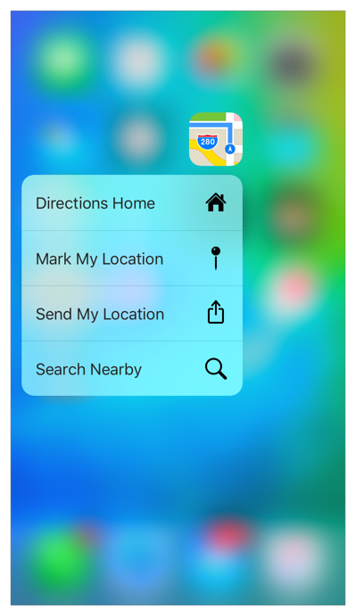
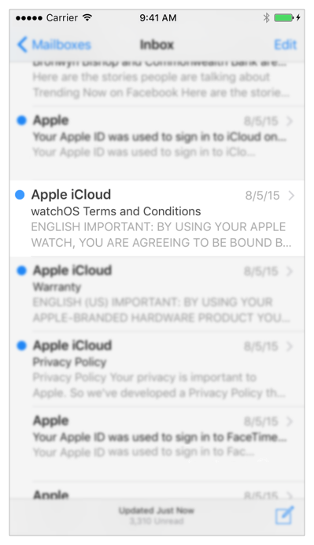
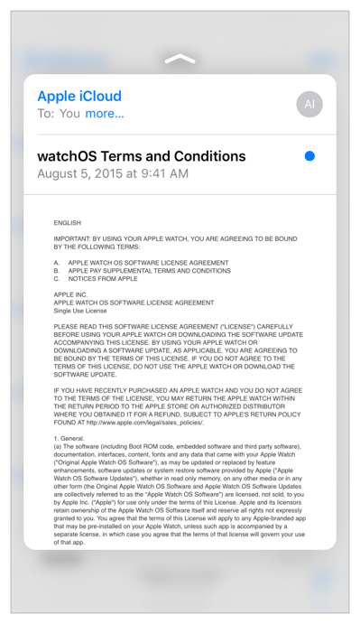
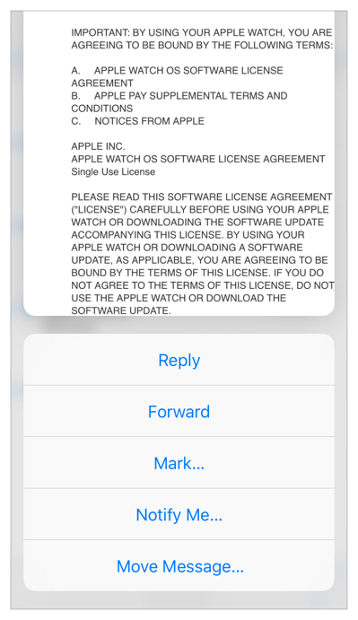

#3D Touch 入门

[原文地址](https://developer.apple.com/library/prerelease/ios/documentation/UserExperience/Conceptual/Adopting3DTouchOniPhone/index.html#//apple_ref/doc/uid/TP40016543)

翻译人:王谦 翻译日期:2015.9.23  审核人:ibcker 审核日期:2015.10.25

    
>重要的
>
>这是一个初步的API开发文档。苹果提供此信息，以帮助您规划将要采用的技术和编程接口。这些信息可能发生变化，根据本文件实施的软件，应与最终的操作系统软件和最终文档进行相应测试。新版本的文档可能提供新的 API 或技术。

iOS 9,新的手机型号为用户界面增加了第三维度的操作。

* 用户现在可以按主屏幕图标立即访问应用程序所提供的功能。
* 现在在你的应用程序,用户可以按视图看到更多内容的预览和获得加速访问特性。

示例代码,下载以下Xcode项目:

* [ApplicationShortcuts: Using UIApplicationShortcutItem],其中演示了主屏幕静态和动态快速的行动。

[ApplicationShortcuts: Using UIApplicationShortcutItem]:https://developer.apple.com/library/prerelease/ios/samplecode/ApplicationShortcuts/Introduction/Intro.html#//apple_ref/doc/uid/TP40016545

* [ViewControllerPreviews: Using the UIViewController previewing APIs],其中演示了peek （预览）和 pop（提交），以及查看快捷操作。

[ViewControllerPreviews: Using the UIViewController previewing APIs]:https://developer.apple.com/library/prerelease/ios/samplecode/ViewControllerPreviews/Introduction/Intro.html#//apple_ref/doc/uid/TP40016546

* [TouchCanvas: Using UITouch efficiently and effectively],这表明 UITouch 类的新强力属性。

[TouchCanvas: Using UITouch efficiently and effectively]:https://developer.apple.com/library/prerelease/ios/samplecode/TouchCanvas/Introduction/Intro.html#//apple_ref/doc/uid/TP40016561

在你开始采用之前,你应该看下 3D Touch 在[iOS Human Interface Guidelines] 里面。

[iOS Human Interface Guidelines]:
https://developer.apple.com/library/prerelease/ios/documentation/UserExperience/Conceptual/MobileHIG/index.html#//apple_ref/doc/uid/TP40006556

##主屏幕的快捷操作

用户总是能够点击一个应用程序图标来启动它,或长按任何应用程序图标来编辑主屏幕。现在,通过按iPhone 6s或者iPhone 6s+的应用程序图标,用户获得一组快捷操作。当用户选择一个快捷操作,启动您的应用程序或者启动应用程序设定好的快捷操作。

最好的快速动作预见并加速用户与应用程序交互。 iOS 9 SDK 提供了api,允许您定义静态或动态快捷操作,与新 iPhone 设备提供给用户。

* 在你的应用程序中定义静态快捷操作。Info.plist 文件[UIApplicationShortcutItems] 数组中。

[UIApplicationShortcutItems]:https://developer.apple.com/library/prerelease/ios/documentation/General/Reference/InfoPlistKeyReference/Articles/iPhoneOSKeys.html#//apple_ref/doc/uid/TP40009252-SW36

* 定义动态快捷操作的 [UIApplicationShortcutItem] 类和相关的API。添加动态快速操作到你的应用程序,使用新的[UIApplication]对象 [shortcutItems] 共享属性。

[UIApplicationShortcutItem]:
https://developer.apple.com/library/prerelease/ios/documentation/UIKit/Reference/UIApplicationShortcutItem_class/index.html#//apple_ref/occ/cl/UIApplicationShortcutItem

[UIApplication]:
https://developer.apple.com/library/prerelease/ios/documentation/UIKit/Reference/UIApplication_Class/index.html#//apple_ref/occ/cl/UIApplication

[shortcutItems]:
https://developer.apple.com/library/prerelease/ios/documentation/UIKit/Reference/UIApplication_Class/index.html#//apple_ref/occ/instp/UIApplication/shortcutItems

这两种类型的快速动作可以显示两行文本以及一个可选的图标。

##Peek and Pop

您现在可以启用应用程序的视图控制器( [UIViewController] 类的实例)应对各种力度的用户按压。当用户按下更用力,交互通过三个阶段:

[UIViewController]:
https://developer.apple.com/library/prerelease/ios/documentation/UIKit/Reference/UIViewController_Class/index.html#//apple_ref/occ/cl/UIViewController

1.表明内容预览

2.显示 preview-known 作为 peek-with 选项来采取行动直接了解 peek 快捷操作

3.在预览中显示的视图的可选导航，称为弹出

当你采用 peek 和 pop ，系统确定的压力，在一个阶段过渡到下一个。用户可以调整设置 > 一般 > 可访问性 > 3D Touch。

####表明peek的可用性

用轻按，周围的内容模糊告诉用户预览的 peek 是额外的内容。

####Peek

更深入地进行视图转换,以显示 peek,您通常配置的视图,以显示更多的内容,如邮件应用程序所做的那样。

如果用户结束了这个点的接触,peek 消失,应用程序返回到它的状态之前,互动开始。

另外在这一点上,用户可以按深仍在 peek 自己导航,使用该系统提供的弹出转换，到视图预览作为一个 peek:弹出转换然后填充应用程序的根视图并显示一个按钮来浏览回到互动开始。（这最后一期显示的弹出视图是不显示在这里。）

####Peek 快捷操作

如果不是结束的触摸,用户点击查看上行,系统显示与你查看相关的 peek 快捷操作。

每一个快捷操作都是深入的链接到您的应用程序。一眼可见的快捷操作,用户可以触摸和peek 保持在屏幕上。这允许用户点击一个快捷操作,调用关联的深层链接。

你也可以启用 peek 和 pop 在 web 视图的链接,描述在 [Web View Peek and Pop]

[Web View Peek and Pop]:
https://developer.apple.com/library/prerelease/ios/documentation/UserExperience/Conceptual/Adopting3DTouchOniPhone/3DTouchAPIs.html#//apple_ref/doc/uid/TP40016543-CH4-SW5

####Force 属性

在 iOS 9, [UITouch] 类有两个新的属性支持 3 d 触摸在你的应用程序中自定义实现:
[force] and [maximumPossibleForce]。首次在 iOS 设备，这些特性让你检测和响应触摸在[UIEvent]对象接收应用程序的压力。

[UITouch]:
https://developer.apple.com/library/prerelease/ios/documentation/UIKit/Reference/UITouch_Class/index.html#//apple_ref/occ/cl/UITouch

[force]:
https://developer.apple.com/library/prerelease/ios/documentation/UIKit/Reference/UITouch_Class/index.html#//apple_ref/occ/instp/UITouch/force

[maximumPossibleForce]:
https://developer.apple.com/library/prerelease/ios/documentation/UIKit/Reference/UITouch_Class/index.html#//apple_ref/occ/instp/UITouch/maximumPossibleForce

[UIEvent]:
https://developer.apple.com/library/prerelease/ios/documentation/UIKit/Reference/UIEvent_Class/index.html#//apple_ref/occ/cl/UIEvent

一个触摸的力量有一个高动态范围，可作为一个浮点值到您的应用程序。

##`3D Touch 的可访问性和人机界面指南`

以确保您的用户可以访问您的应用程序的所有功能,取决于你的代码是否可以获得 3D Touch 分支。看[Checking for 3D Touch Availability]。

[Checking for 3D Touch Availability]:
https://developer.apple.com/library/prerelease/ios/documentation/UserExperience/Conceptual/Adopting3DTouchOniPhone/3DTouchAPIs.html#//apple_ref/doc/uid/TP40016543-CH4-SW2

>请注意
>
>3 d 触摸只能在 3 d 触摸设备上启用。在 iOS 9 中,3 d 触摸默认情况下是启用的。用户可以关闭 3 d 在设置 > 一般 > 可访问性 > 3D Touch。

当 3 d 触摸是可用的,利用它的能力。当它不可用时,提供替代品,如采用触摸和保持。

3D Touch 特性支持 VoiceOver。了解 VoiceOver,读[Accessibility Programming Guide for iOS]。

[Accessibility Programming Guide for iOS]:
https://developer.apple.com/library/prerelease/ios/documentation/UserExperience/Conceptual/iPhoneAccessibility/Introduction/Introduction.html#//apple_ref/doc/uid/TP40008785

关于 3D Touch 的新功能的重要指导,看 [3D Touch] 在 [iOS Human Interface Guidelines].

[3D Touch]:
https://developer.apple.com/library/prerelease/ios/documentation/UserExperience/Conceptual/MobileHIG/3DTouch.html#//apple_ref/doc/uid/TP40006556-CH71

[iOS Human Interface Guidelines]:
https://developer.apple.com/library/prerelease/ios/documentation/UserExperience/Conceptual/MobileHIG/index.html#//apple_ref/doc/uid/TP40006556

##`开发环境`

Xcode 7支持3D Touch开发

牢记以下:

* Xcode 7 你必须在一个支持 3D Touch 设备中开发。在Xcode 7模拟器不支持3D Touch 。

* Xcode 7 你必须实现你的 peek 和 pop 在代码视图控制器。在 Xcode 7 界面生成器不提供 3D Touch 的Interface Builder。

确保测试您的应用程序与 3D Touch 两个启用和禁用，确保所有功能都是可供所有用户。在一个支持 3D Touch 的设备，您可以在设置中禁用的 3D Touch > 一般 > 可访问性 > 3D Touch。