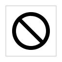
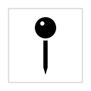
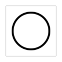
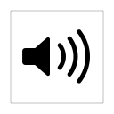

#UIApplicationShortcutIcon

[原文地址](https://developer.apple.com/library/prerelease/ios/documentation/UIKit/Reference/UIApplicationShortcutIcon_Class/index.html#//apple_ref/occ/clm/UIApplicationShortcutIcon/iconWithContact:)

翻译人:王谦 翻译日期:2015.9.26   审核人:ibcker 审核日期:2015.10.25

>重要的
>
>这是一个初步的API开发文档。苹果提供此信息，以帮助您规划将要采用的技术和编程接口。这些信息可能发生变化，根据本文件实施的软件，应与最终的操作系统软件和最终文档进行相应测试。新版本的文档可能提供新的 API 或技术。

| 继承自        |   符合     |    导入语句     |
|   --------   | :--------  |:----    |
| NSObject UIApplicationShortcutIcon |NSCopying      NSObject      |   @import UIKit;       |
|          |       |    可用性 |
|          |      |  可用 在 iOS 9.0 和以后  |

一个应用程序的快捷方式,或者快捷操作,你可以随意的图标的图片和主屏幕快捷操作相关联改进它的外观和可用性。

关联一个图标的快捷操作,通过它的快捷操作项初始化方法,描述[UIApplicationShortcutItem Class Reference]。

[UIApplicationShortcutItem Class Reference]:
https://developer.apple.com/library/prerelease/ios/documentation/UIKit/Reference/UIApplicationShortcutItem_class/index.html#//apple_ref/doc/uid/TP40016501

这里是快捷操作图标的类型:

* 系统提供的库共有的类型的图标,列举描述在 [UIApplicationShortcutIconType]()。

* 在你的应用程序 bundle 下一个图标得到一个自定义的图片,最好是在一个资产目录。(看 [Template Images] 在 [UIKit User Interface Catalog] 和 [Asset Catalog Help])

 [Template Images]:
https://developer.apple.com/library/prerelease/ios/documentation/UserExperience/Conceptual/UIKitUICatalog/index.html#//apple_ref/doc/uid/TP40012857-UIView-SW7

[UIKit User Interface Catalog]:
https://developer.apple.com/library/prerelease/ios/documentation/UserExperience/Conceptual/UIKitUICatalog/index.html#//apple_ref/doc/uid/TP40012857

[Asset Catalog Help]:
https://developer.apple.com/library/prerelease/ios/recipes/xcode_help-image_catalog-1.0/_index.html#//apple_ref/doc/uid/TP40013303

* 一个图标代表一个用户地址簿联系,你访问通过ContactsUI  framework (看 [ContactsUI Framework Reference])

[ContactsUI Framework Reference]:
https://developer.apple.com/library/prerelease/ios/documentation/ContactsUI/Reference/ContactsUI_Framework/index.html#//apple_ref/doc/uid/TP40016207

##`创建一个快捷操作图标`

**1.**[+ iconWithType:]()

创建一个主屏幕快捷方式图标使用系统定义的图片。

####演示
>SWIFT
>
>convenience init(type type: UIApplicationShortcutIconType)

>OBJECTIVE-C
>
> +(instancetype)iconWithType:(UIApplicationShortcutIconType)type

####参数
| type|使用系统定义的图片图标。合适的图片清单,看[UIApplicationShortcutIconType]()的列举。|
|--:|:----|

####返回值

初始化一个主屏幕快捷操作图标的指定系统图片。

####论述

使用方法创建系统支持的图标行动。用户期望系统定义行动的图片只用于预期的行动。

####可用性

可用在 iOS 9.0和以后

 **2.**[+ iconWithTemplateImageName:]()

创建一个基于你应用程序约束的图片主屏幕快捷操作,最好是在一个资产目录。

####演示
>SWIFT
>
>convenience init(templateImageName templateImageName: String)

>OBJECTIVE-C
>
>+ (instancetype)iconWithTemplateImageName:(NSString *)templateImageName

####参数
|templateImageName|在你的应用程序中自定义一个图片资产目录名字。如果图片没有在你的资产目录中,这个方法会搜索你应用程序 bundle  中的图片。  你不需要指定文件扩展名或@2x @3x修饰符的名字。该方法检索适当的图像基于可用的系统和图像资源。|
|---:|:---|

####返回值

主屏幕快速初始化操作图标与指定的应用程序提供的模板图片。

####论述

你提供一个自定义原图使用方法创建一个图标。如果你指定图片的名字不对应于一个有效的图像资源的应用程序包,你关联的图标将不会显示在快捷操作中。

图标应该正方形,单一的颜色,和35 x35点, [template files] 所示 和 描述在 [Template Images]  在 [UIKit User Interface Catalog] 和在 [iOS Human Interface Guidelines]。

[template files]:
https://developer.apple.com/design/downloads/Quick-Action-Guides.zip

[Template Images]:
https://developer.apple.com/library/prerelease/ios/documentation/UserExperience/Conceptual/UIKitUICatalog/index.html#//apple_ref/doc/uid/TP40012857-UIView-SW7

[UIKit User Interface Catalog]:
https://developer.apple.com/library/prerelease/ios/documentation/UserExperience/Conceptual/UIKitUICatalog/index.html#//apple_ref/doc/uid/TP40012857

[iOS Human Interface Guidelines]:
https://developer.apple.com/library/prerelease/ios/documentation/UserExperience/Conceptual/MobileHIG/index.html#//apple_ref/doc/uid/TP40006556

####可用性

可用在 iOS 9.0和以后

**3.**[+ iconWithContact:]()

创建一个主屏幕快捷操作图标,如果有效就使图片关联,或者创建一个联系人姓名的字母组合。

####演示
>SWIFT
>
>convenience init(contact contact: CNContact)

>OBJECTIVE-C
>
>+(instancetype)iconWithContact:(CNContact *)contact

####参数
| contact |来自[CNContact]()联系对象的图标。|
|---:|:---|

####论述

使用这个方法,通过一个关联自用户关联的数据库,可以通过[CNContactStore]()对象。如果关联一个指定的图片,他系统创建一个全彩图片快速操作图标。如果没有关联图标,系统采用接触的首字母和显示一个字母组合。

>注意
>
>该方法使用关联的框架,描述在 [Contacts Framework Reference]()。

在 runtime 你可以通过一个选择一个在 ［CNContact]() 的对象。
这样的接触必须至少有一个姓或名。该方法返回的快速操作图标然后从接触一个字母组合的名字。使用这种方法,它不可能为你提供快捷操作图标的图片。

当提供关联一组快捷操作,确保每个都有一个图标。这样可以确保最好的外观的快捷操作。

####演示
>SWIFT
>
>@import ContactsUI;

>OBJECTIVE-C
>
>import ContactsUI

####可用性

可用在 iOS 9.0和以后

##常量

[UIApplicationShortcutIconType]()

系统提供的图标。

####演示
>SWIFT
>
>enum UIApplicationShortcutIconType : Int {
     case Compose
     case Play
     case Pause
     case Add
     case Location
     case Search
     case Share
     case Prohibit
     case Contact
     case Home
     case MarkLocation
     case Favorite
     case Love
     case Cloud
     case Invitation
     case Confirmation
     case Mail
     case Message
     case Date
     case Time
     case CapturePhoto
     case CaptureVideo
     case Task
     case TaskCompleted
     case Alarm
     case Bookmark
     case Shuffle
     case Audio
     case Update
 }

>OBJECTIVE-C
>
>
>typedef enum UIApplicationShortcutIconType : NSInteger {
    UIApplicationShortcutIconTypeCompose,
    UIApplicationShortcutIconTypePlay,
    UIApplicationShortcutIconTypePause,
    UIApplicationShortcutIconTypeAdd,
    UIApplicationShortcutIconTypeLocation,
    UIApplicationShortcutIconTypeSearch,
    UIApplicationShortcutIconTypeShare,
    UIApplicationShortcutIconTypeProhibit,
    UIApplicationShortcutIconTypeContact,
    UIApplicationShortcutIconTypeHome,
    UIApplicationShortcutIconTypeMarkLocation,
    UIApplicationShortcutIconTypeFavorite,
    UIApplicationShortcutIconTypeLove,
    UIApplicationShortcutIconTypeCloud,
    UIApplicationShortcutIconTypeInvitation,
    UIApplicationShortcutIconTypeConfirmation,
    UIApplicationShortcutIconTypeMail,
    UIApplicationShortcutIconTypeMessage,
    UIApplicationShortcutIconTypeDate,
    UIApplicationShortcutIconTypeTime,
    UIApplicationShortcutIconTypeCapturePhoto,
    UIApplicationShortcutIconTypeCaptureVideo,
    UIApplicationShortcutIconTypeTask,
    UIApplicationShortcutIconTypeTaskCompleted,
    UIApplicationShortcutIconTypeAlarm,
    UIApplicationShortcutIconTypeBookmark,
    UIApplicationShortcutIconTypeShuffle,
    UIApplicationShortcutIconTypeAudio,
    UIApplicationShortcutIconTypeUpdate 
 } UIApplicationShortcutIconType;

####常量

* `UIApplicationShortcutIconTypeCompose `

 一个图标快捷操作,允许一个用户组成新的内容。
 
 
 
 
 可用在 iOS 9.0 和以后
 

* `UIApplicationShortcutIconTypePlay`

 快捷操作播放媒体文件的图标。
 
 
 
  可用在 iOS 9.0 和以后
 
 
* `UIApplicationShortcutIconTypePause `

  快捷操作播放媒体文件的暂停图标。
  
  
 
  
 
  可用在 iOS 9.0 和以后
  
  
* `UIApplicationShortcutIconTypeAdd `

 一个快捷操作添加项。

 
 
 可用在 iOS 9.0 和以后
 
* `UIApplicationShortcutIconTypeLocation `

 一个图标快捷操作,访问用户的当前位置。

 
 
  可用在 iOS 9.0 和以后
 
* `UIApplicationShortcutIconTypeSearch `

 一个提供搜查的快捷操作图标。

 

  可用在 iOS 9.0 和以后
  
  
* `UIApplicationShortcutIconTypeShare`

 一个提供分享功能的快捷操作图标。

 
 
 可用在 iOS 9.0 和以后

* `UIApplicationShortcutIconTypeProhibit`

   一个不允许的快捷操作图标。
  
  
  
   可用在 iOS 9.0 和以后
   
   
* `UIApplicationShortcutIconTypeContact`

  一个选择联系人的快捷操作图标。

 

 可用在 iOS 9.1 和以后
 
 
* `UIApplicationShortcutIconTypeHome`

  一个显示 home 的快捷操作图标。
  
   
   
   可用在 iOS 9.1 和以后
   
   
* `UIApplicationShortcutIconTypeMarkLocation `

 一个用户标记位置的快捷操作图标。

 
   
  可用在 iOS 9.1 和以后
  
  
* `UIApplicationShortcutIconTypeFavorite`

   一个用户指定收藏项的快捷操作图标。
  
   

   可用在 iOS 9.1 和以后

* `UIApplicationShortcutIconTypeLove `

  一个用户指定喜欢项的快捷操作图标。
  
  
  
  
  
  可用在 iOS 9.1 和以后
  
  
* `UIApplicationShortcutIconTypeCloud `

 一个提供云存储的快捷操作图标。

 

 可用在 iOS 9.1 和以后
 
 
 
* `UIApplicationShortcutIconTypeInvitation `
 
 一个表示下载的快捷操作图标。
 
 
 
 可用在 iOS 9.1 和以后
 
 
* `UIApplicationShortcutIconTypeConfirmation `

 一个显示确认的快捷操作图标。

 

 可用在 iOS 9.1 和以后

* `UIApplicationShortcutIconTypeMail `

 一个表示提供邮件的快捷操作图标。

 

 可用在 iOS 9.1 和以后

* `UIApplicationShortcutIconTypeMessage `

 一个表示提供用户消息的快捷操作图标。

 

 可用在 iOS 9.1 和以后

* `UIApplicationShortcutIconTypeDate `

 一个表示提供日历的快捷操作图标。
 
  
  
   可用在 iOS 9.1 和以后
   
* `UIApplicationShortcutIconTypeTime `

 一个表示提供时间的快捷操作图标。
  
  
  
  
   可用在 iOS 9.1 和以后
  
  
* `UIApplicationShortcutIconTypeCapturePhoto `

 一个表示提供拍照的快捷操作图标。
 
 
 
 可用在 iOS 9.1 和以后

* `UIApplicationShortcutIconTypeCaptureVideo `

 一个表示提供录像的快捷操作图标。
 
 
 
 可用在 iOS 9.1 和以后

* `UIApplicationShortcutIconTypeTask `

 一个表示提供任务创造的快捷操作图标。

 

 可用在 iOS 9.1 和以后

* `UIApplicationShortcutIconTypeTaskCompleted `

 一个表示完成任务的快捷操作图标。
 
 
 
 可用在 iOS 9.1 和以后

* `UIApplicationShortcutIconTypeAlarm `

 一个表示创造闹钟的快捷操作图标。
 
 
 

 可用在 iOS 9.1 和以后

* `UIApplicationShortcutIconTypeBookmark `

 一个表示书签的快捷操作图标。
 
 
 
 
 可用在 iOS 9.1 和以后

* `UIApplicationShortcutIconTypeShuffle `

 一个表示改组的快捷操作图标。
 
 
 
  可用在 iOS 9.1 和以后
 

* `UIApplicationShortcutIconTypeAudio `

 一个表示使用声音的快捷操作图标。
 
 

 可用在 iOS 9.1 和以后

* `UIApplicationShortcutIconTypeUpdate `

 一个表示更新的快捷操作图标。
 
 

 可用在 iOS 9.1 和以后
 
 
####重要声明

>OBJECTIVE-C
>
>@import UIKit;

>SWIFT
>
>import UIKit

####可用性

 可用在 iOS 9.0 和以后