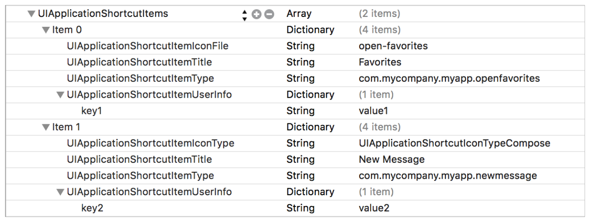

#UIApplicationShortcutItems

[原文地址](https://developer.apple.com/library/prerelease/ios/documentation/General/Reference/InfoPlistKeyReference/Articles/iPhoneOSKeys.html#//apple_ref/doc/uid/TP40009252-SW36)

翻译人:王谦 翻译日期:2015.9.27  审核人:ibcker 审核日期:2015.10.25

`UIApplicationShortcutItems`(Array - iOS)指定应用程序主屏幕静态快捷操作。这个键包含字典数组。每个字典详细信息包含一个快捷操作和如何使用它。

您可以指定静态快捷操作应用程序作为字典的一个数组。但当用户按下支持3D Touch的设备的主屏幕图标是，显示在你应用程序主屏幕上的快捷操作的数量,是由系统决定的。

静态快捷操作定义你plist文件的信息然后以相同的顺序显示出现主屏幕上。首先静态快捷操作设置主屏幕快捷操作的系统填充组,且仅当有额外的插槽你的定义动态快捷操作可用它才显示。动态快捷操作的更多信息,请参见 Adopting 3D Touch on iPhone。

下面的代码清单显示了示例定义当他们出现在相应的属性列表文件:

>``< key >UIApplicationShortcutItems < / key >`

    <array>
        <dict>
            <key>UIApplicationShortcutItemIconFile</key>
            <string>open-favorites</string>
            <key>UIApplicationShortcutItemTitle</key>
            <string>Favorites</string>
            <key>UIApplicationShortcutItemType</key>
            <string>com.mycompany.myapp.openfavorites</string>
            <key>UIApplicationShortcutItemUserInfo</key>
            <dict>
                <key>key1</key>
                <string>value1</string>
            </dict>
        </dict>
        <dict>
            <key>UIApplicationShortcutItemIconType</key>
            <string>UIApplicationShortcutIconTypeCompose</string>
            <key>UIApplicationShortcutItemTitle</key>
            <string>New Message</string>
            <key>UIApplicationShortcutItemType</key>
            <string>com.mycompany.myapp.newmessage</string>
            <key>UIApplicationShortcutItemUserInfo</key>
            <dict>
                <key>key2</key>
                <string>value2</string>
            </dict>
        </dict>
    </array>`
    
    
    
当用户选择一个主屏幕快速操作,系统启动或恢复你的应用和 UIKit 调用应用程序: [performActionForShortcutItem:completionHandler:]() 方法在应用程序委托。一定要读的描述方法在 [UIApplicationDelegate Protocol Reference ]()如何确保信息的方法在应该用到时被调用。

检索的属性获得快捷操作,使用`UIApplicationLaunchOptionsShortcutItemKey`启动选项键,[UIApplicationDelegate Protocol Reference ]()描述。这个关键是[UIApplicationShortcutItem]() 对象的值。可用的属性得到了快捷操作的对象属性。

表2列出了 keys ,可以包含在数组的每一个字典。

表2对主屏幕键快捷操作,也称为快捷项目

|Key|论述|
|:---|:---|
|`UIApplicationShortcutItemType`(必须)|所需的字符串传递给应用程序,当用户调用相应的快捷操作。应用程序可以使用这个字符串来快速动作的类型进行分类,然后在行动中消除歧义类型它接收。你不需要注册你的快捷操作类型。|
|`UIApplicationShortcutItemTitle `(必须)|一个字符串在主屏幕上显示给用户的名称快捷操作。如果标题适合在一行上,系统显示一行快捷操作项目。                   如果一行的标题太长,你没有指定一个`UIApplicationShortcutItemSubtitle`字符串,系统显示两行标题。   可选地,您可以快速国际化行动标题采用app `InfoPlist.strings `文件。指导如何做到这一点,读[Localizing Property List Values]()。|
|`UIApplicationShortcutItemSubtitle `|一个可选的字符串在主屏幕上显示给用户,立即在相应的标题字符串下方。   如果你指定一个副标题快捷操作,迅速采取行动的系统显示标题在一行(也许只是一个部分的标题,紧随其后的是省略字符),不管标题是多长。   可选地,您可以将快捷操作副标题 InfoPlist.strings 文件通过使用你的应用置于公共管理下。指导如何做到这一点,读[Localizing Property List Values]()。|
|`UIApplicationShortcutItemIconType `|一个可选的字符串指定类型的图标从系统提供的库,看 [UIApplicationShortcutIconType]() 列举在 [UIApplicationShortcutIcon Class Reference]()。在主屏幕上快捷操作的图标设置为您显示的应用程序,以及快捷操作的标题。|
|`UIApplicationShortcutItemIconFile `|一个可选的字符串指定一个图标图像使用应用程序的包,或者资产目录中的一个形象的名字。图标是现实在之前快捷操作标题的主屏幕上。  图标应该正方形,单一的颜色,和35 x35点,看这些模板文件[iOS Human Interface Guidelines]()中描述。   如果指定这个键,系统忽略了`UIApplicationShortcutItemIconType`的关键|
|`UIApplicationShortcutItemUserInfo `|一个可选,app-defined 字典。一个使用这本字典是提供应用程序版本信息,按照“应用发射和应用更新注意事项快捷操作”部分的概述[UIApplicationShortcutItem Class Reference]() 上参考。|

这 key 是支持iOS 9.0及以后和支持 3D Touch 的设备。