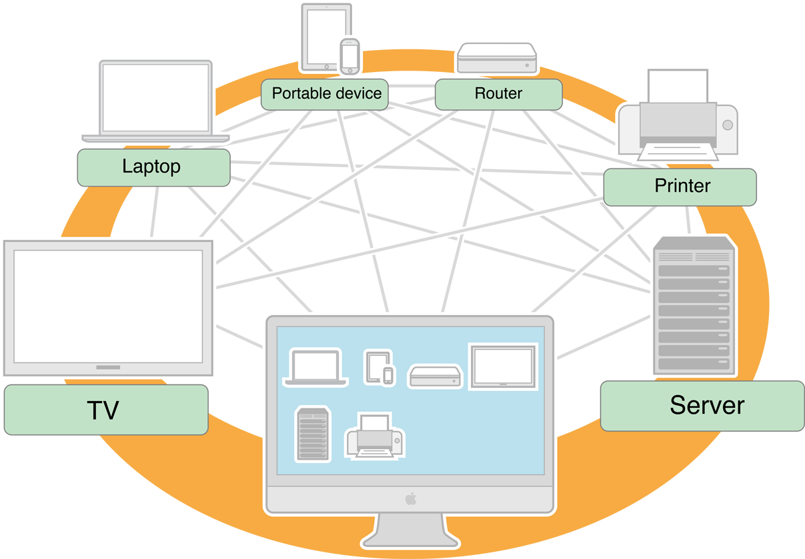

#关于 Bonjour

[原文地址](https://developer.apple.com/library/ios/documentation/Cocoa/Conceptual/NetServices/Introduction.html#//apple_ref/doc/uid/TP40002445-SW1) 

 翻译人:贝勒爷、 翻译日期:2015.9.1
 
Bonjour,也称为零配置联网,该结构提供了在局域网和广域网上传播和探寻TCP/IP的基础服务。本文档描述了高层次的 Bonjour 结构.并且简要描述了哪些 Bonjour API 是可用的。

>注意：本文档并不能作为编程指南，只是提供了一个高层次概览。想要获取更多的API细节(包括代码片段)，你应该阅读 [DNS Service Discovery Programming Guide] 或者 [NSNetServices and CFNetServices Programming Guide] 。

[DNS Service Discovery Programming Guide]:
https://developer.apple.com/library/ios/documentation/Networking/Conceptual/dns_discovery_api/Introduction.html#//apple_ref/doc/uid/TP30000964

[NSNetServices and CFNetServices Programming Guide]:
https://developer.apple.com/library/ios/documentation/Networking/Conceptual/NSNetServiceProgGuide/Introduction.html#//apple_ref/doc/uid/TP40002736



#简述
Bonjour 是苹果对一套零配置联网协议的实现。Bonjour 的设计让用户使用网络配置更为方便。

例如，Bonjour 让您将打印机连接到您的网络，而不必为其手动分配一个特定的 IP 地址或者手动输入这个地址到每台计算机。有了零配置联网，电脑附近就可以发现它的存在，并自动确定打印机的 IP 地址。如果地址是动态分配地变化，他们也能在不久的时间内自动发现这些新地址。

应用程序还可以利用 Bonjour 自动检测网络中其他应用程序的实例(或其他服务)。例如，两个用户运行 iOS 照片共享的应用程序，这个程序能够在蓝牙个人区域网络共享照片而不需要手动配置设备的 IP 地址。


####Bonjour 提供有效的服务搜索
Bonjour 协议支持广告和搜索服务的方式，高效稳健地使用组播 DNS,并且在需要的时候链接地址。

>相关章节:Bonjour Concepts

###Bonjour 保留本地域组播 DNS 广告服务
Bonjour使用一套特定的规则来搭建主机名和服务名。
>相关章节：Domain Naming Conventions

###Bonjour使用SRV,TXT和PTR记录查找服务
Bonjour 使用特定服务记录广告服务的存在。PTR 记录让你发现所有领域的服务；SRV 记录将服务实例的名称、类型和域转为主机名和端口；A和 AAAA 记录将主机名称翻译成一个 IP 地址，还有 TXT 记录提供额外的信息服务。
>相关章节：Bonjour Operations

### Bonjour 为 OS X 和 iOS 提供多层的 API
在OS X和iOS中，Bonjour提供打广告的可行性，并且使用Foundation ，Core Foundation和C API。在OS X，Bonjour还提供了Java API.其他平台像Windows和Linux，Bonjour提供了C API。
>相关章节：Bonjour API Architecture


##预备知识
本文档假设您已经熟悉 [Networking Overview] 和 [Networking Concepts]。

[Networking Overview]:
https://developer.apple.com/library/ios/documentation/NetworkingInternetWeb/Conceptual/NetworkingOverview/Introduction/Introduction.html#//apple_ref/doc/uid/TP40010220

[Networking Concepts]:
https://developer.apple.com/library/ios/documentation/NetworkingInternet/Conceptual/NetworkingConcepts/Introduction/Introduction.html#//apple_ref/doc/uid/TP40012487


##另请参阅
* [DNS Service Discovery Programming Guide]描述了适合Darwin和Windows程序员和开发人员的Bonjour API.
* [NSNetServices and CFNetServices Programming Guide] 描述了适合Cocoa程序员、C和C++程序员在OS X和iOS平台的Bonjour API。




