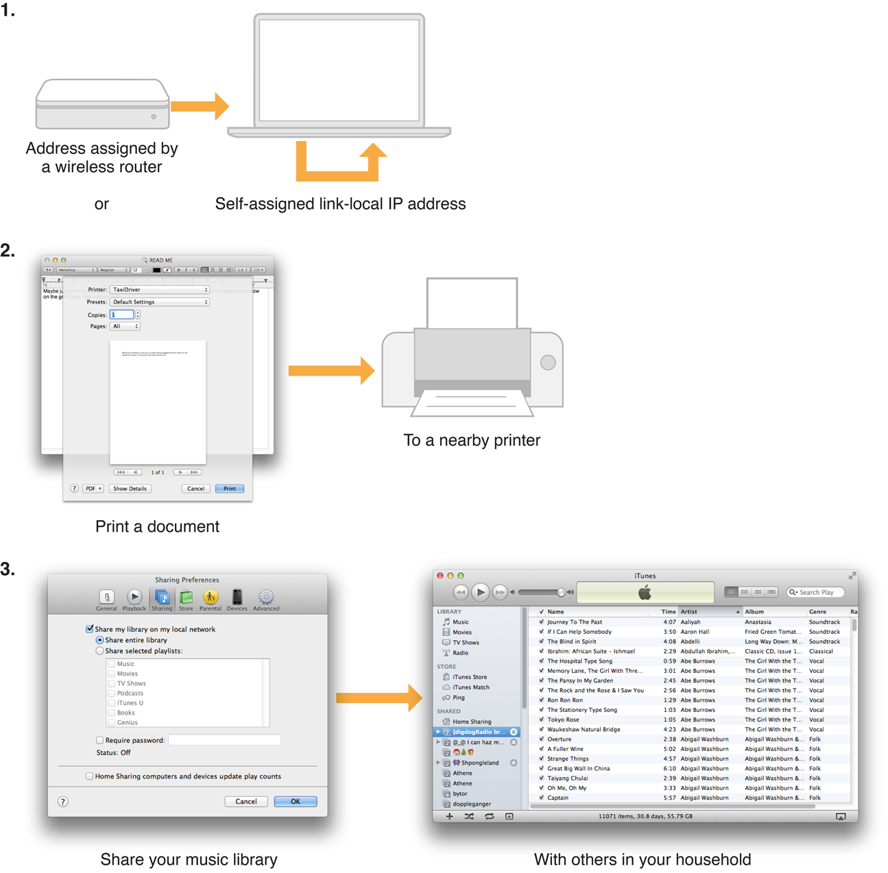

#关于 Bonjour

[原文地址](https://developer.apple.com/library/ios/documentation/Cocoa/Conceptual/NetServices/Articles/about.html) 

 翻译人:王谦 翻译日期:2015.10.8
 
 Bonjour 是一套零配置网络协议的 IP,苹果已经提交到 IETF 持续 standards-creation 过程的一部分。本节描述 Bonjour 解决的问题以及如何解决它们。
 
 
##为什么 Bonjour ?
 
 在过去的二十年里,电脑已经逐渐转变远离特定于平台的协议(如可路由协议组,IPX, NetBIOS 向互联网协议(IP)。大多数计算机和其他网络设备全部使用 TCP/IP 进行通讯。在这过渡,然而,一块的功能是将设备添加到本地网络失去了能力,然后连接这些设备从网络上的计算机和其他设备,与很少或没有配置。
 
 
IP 工作,每个设备需要一个唯一的地址, 无论静态的分配和动态的分配通过一个 DHCP 服务。一个动态分配地址可以改变,没用 Bonjour,打印机和其他设备必须手动配置一个静态地址所以使网络上的计算机可以够到他们。那时,一个网络管理员配置一个 DNS 服务所以计算机用户没有通过 IP 地址连接到打印机。因此,一个看上去次要的任务必须有效的配置。因为人不符合传统角色的网络管理员经常设置 networks-families 将笔记本电脑连接到互联网在一个共享的路由器。例如 — 级别的配置是不实际的。

哪怕由 IT 专业人员管理网络,没有意义需要手动配置打印机等设备。人们期望能够插入打印机,同时插入两个打印机,或者找一个文件服务器或游戏服务器在本地网络上不浪费时间试图获得正确的配置。

支持这个,人们需要一个简单可靠的方法通过IP网络配置和浏览服务。他们想要发现可获得服务和从一个清单上选择,而不必事先知道每个服务名或 IP 地址。在对知识产权所有人的利益这一功能。这是 Bonjour 提高的正确的功能。

##零配置:一个例子

零配置 IP 网络保留一个潜在大的数量。考虑每天的印刷任务。一旦一个打印机在你的电脑或者 iOS 设备上配置,这是简单的选择一个应用程序的打印命令。

带你的笔记本电脑去客户的公司,或者一个邻居家,和试图印刷的人。如果他们有一个打印机支持 Bonjour 协议,在你的本地网络印刷非常简单。打印,你的笔记本电脑连接到客户的 Wi-Fi 接入点和启动你的笔记本电脑。或启动你的笔记本电脑,它立刻发现你邻居的家庭无线网络。无论哪种方式,你的笔记本电脑自动发现任何可用的打印机。你打开文件,选择打印命令,每一个可用的打印机打印对话框中出现。你选择一个打印机,点击打印,打印的文档。

或者说你想和一个朋友一起玩网络游戏。你打开游戏,你朋友的游戏副本立刻在网络上看到你的副本。或者如果你有一个音乐共享应用程序在两个电脑,程序本身可以发现彼此,立即交换歌曲列表。同样的,如果你有一个共享文件夹或个人网络共享,共享文件和 Web 页面立即可用。

此场景如图 1-1 所示。在步骤1中,你在你的邻居的房里打开你的笔记本,笔记本电脑获取一个地址从 DHCP 服务器在路由器或在缺乏 DHCP 服务器时候分配一个可用的本地地址。在步骤 2 中,网络查询可用打印机,这样当你打开打印对话框,列出你邻居的打印机。最后,在步骤 3 中,你在你的电脑里打开音乐分享,在你的邻居的电脑看到连接。

这些只是几个现有的应用程序可以从零配置 IP 网络中受益。零配置 IP 网络有可能提高手机游戏,家庭网络,分布式计算,和许多其他的网络应用程序。此外,零配置 IP 网络打开了门全新的 IP 接入数字设备类。

图 1-1 一个典型的零配置网络会话

##什么是 Bonjour ?

Bonjour 是苹果提供的零配置网络 IP。Bonjour 来自 ZEROCONF 工作组的工作,互联网工程任务组( IETF )的一部分。ZEROCONF 工作组的要求,提出解决方案零配置网络 IP 基本上涵盖三大领域:

* 地址(配置主机的 IP 地址)
* 名称(使用参考名称到主机代替 IP 地址)
* 服务发现(自动在网络法案服务)

Bonjour 有一个这三个区域的零配置解决方案,如以下四部分所述。

Bonjour 允许服务提供者,硬件制造商,和应用程序程序员支持单个网路 protocol—IP—while 阻断新的组易于使用。

网络用户不再需要分配 IP 地址,指定主机名,甚至网络上键入名称来访问服务。用户只是要求看什么网络服务可用,并从列表中选择。

在许多方面,这种浏览甚至比用户更强大的应用程序。应用程序可以自动检测服务他们需要或其他应用程序可以相互作用,允许自动连接,通信和数据交换,不需要用户干预。

###地址
解决问题是通过自分配链路本地寻址解决。链接地址使用一系列的地址留给本地网络,通常一个小的局域网或一个局域网段。为此, IPv6 规范包含自定链接解决作为协议的一部分。主要解决挑战零配置 IPv4 网络改造这个能力。

> 注意:IPv6 链接处理比 IPv4 简单链接处理更加可靠。由于这个原因,重要的是,你的应用程序支持 IPv6。

在 IPv4,自定解决是通过选择一个随机的IP地址的链接范围和测试。如果地址不使用,它成为你的本地地址。如果它已经在使用,计算机或其他设备随机选择另一个地址并再次尝试。

> 注意:两个主机在同一地方被认为是链接,如果当一个主机发送数据包到另一端,整个链路层有效载荷(数据包的内容代表的物理网络,如以太网)来修改的。在以太网网络,在实践中,这意味着没有 IP 路由器触动两个主机之间的数据包。

链接解决 IPv4 和 IPv6 支持在大多数主要的操作系统。硬件制造商应该在他们的设备上实现链接处理获得的全部好处 Bonjour。

任何用户或服务在计算机或 iOS 设备支持链接自动寻址受益于这个特性。当你的主机遇到本地网络时,它发现一个未使用的本地地址和采用它。不需要你行动。

###命名

提议的解决方案的名称到地址的翻译在本地网络使用多路广播 DNS (mDNS),在这 DNS-format 查询发送本地网络使用 IP 多路广播。因为这些 DNS 查询发送一个多路广播地址,没有一个 DNS 服务器需要全球知识回答查询。每个服务或设备可以提供自己的 DNS capability-when 它看到一个查询自己的名字,它提供了一个 DNS 回应自己的地址。

Bonjour 要更进一步。它包括一个应答器处理 mDNS 查询主机或iOS 设备上的任何网络服务。这使您的应用程序的需要解释和应对 mDNS 消息。通过注册服务,Bonjour mDNSResponder 守护进程自动宣传您的服务的可用性,以便任何查询你的名字自动定向到正确的IP地址和端口号。

>注意:登记使用 Bonjour api 执行。此功能只提供给服务主机或iOS 设备上运行。服务运行在其他设备,例如打印机,需要实现一个简单的 mDNSResponder 守护进程来处理查询设备的提供的服务。

Bonjour 还提供内置支持 NAT 端口映射协议 (NAT-PMP)。如果上游路由器支持这个协议,OS X 和 iOS 应用程序可以创建和摧毁端口映射允许主机防火墙的另一端连接提供服务。(NAT进一步描述了端口映射 [Firewalls and Network Address Translation] 在 [Networking Overview])

[Firewalls and Network Address Translation]:
https://developer.apple.com/library/ios/documentation/NetworkingInternet/Conceptual/NetworkingConcepts/PacketRoutingandDelivery/PacketRoutingandDelivery.html#//apple_ref/doc/uid/TP40012487-CH11-SW2

[Networking Overview]:
https://developer.apple.com/library/ios/documentation/NetworkingInternetWeb/Conceptual/NetworkingOverview/Introduction/Introduction.html#//apple_ref/doc/uid/TP40010220

名称到地址转换正确的工作,一个唯一的名称在本地网络上是必要的。与传统的 DNS 主机名,本地网络上的本地名称只有意义或局域网段。可以self-assign 本地名称相同的方式 self-assign 当地 address-choose ;如果这不是已经在使用,它是你的:

* 硬件制造商确定他们选择的名字已经在使用自己的设备发送一个mDNS  查询名称和寻找任何响应。如果有反应,设备应选择另一个名称。没有用户界面的设备在一个默认的名字上附加一个递增的数字,直到这个名字是唯一的。例如,如果一个`XYZ-LaserPrinter`打印机使用默认名称。本地连接本地网络和另外两个相同的打印机已经安装了,这对`XYZ-LaserPrinter`测试。地方,然后`XYZ-LaserPrinter-2`。地方,然后`XYZ-LaserPrinter-3`。地方,未使用的,成为它的名字。

* 软件服务注册 Bonjour 时提供一个名称。如果提供的名称已经被使用, Bonjour 会自动重命名默认为你服务。

在 OS X 中,用户可以设置主机名的电脑通过本地主机名设置共享窗格的系统首选项。(在 iOS,主机名是自动生成的,是不可配置的)。可以使用这个主机名本地传统的 DNS 主机名使用网络浏览器,命令行工具,等等。指示系统,一个名字是本地主机名称,添加一个点(.)和地方。主机名; Steve.local 。是一个本地主机名。

>重要的:第一个点作为分隔符。防止应用程序使用搜索域,在本地寻找服务完全列举一个主机名添加最后一个点。

例如,如果一个用户类型 steve.local。到一个 Web 浏览器,这告诉系统多路广播请求史蒂夫在本地网络上而不是发送给传统的 DNS 服务器。如果 Bonjour-enabled 计算机名为史蒂夫在本地网络,用户的浏览器发送正确的 IP 地址。这允许用户访问本地主机和服务没有传统的 DNS 服务器。

>注意:用户可以避免打字。local。Bonjour 后进入本地主机名的搜索域的网络面板在系统偏好,以及任何其他 DNS 域如 apple.com 或earthlink.net。一个不合格的名称,如史蒂夫,寻找在连续域网络的搜索域部分列出的窗格中,在这种情况下, steve.apple.com,steve.earthlink.net,和steve.local 。

更多信息,看[Domain Naming Conventions]。

[Domain Naming Conventions]:
https://developer.apple.com/library/ios/documentation/Cocoa/Conceptual/NetServices/Articles/domainnames.html#//apple_ref/doc/uid/TP40002460-SW1

###发现服务

Bonjour,是发现服务的最后一个元素。发现服务允许应用程序找到的所有可用的实例特定类型的服务和维护列表命名服务和端口号。应用程序可以解决服务主机名的 IPv4 和 IPv6 地址列表,如命名。

命名服务的列表提供了一个间接层之间的服务和当前 DNS 名称和端口号。间接允许应用程序保持持续可用服务列表并解决一个实际的网络地址之前使用一个服务。通知改变列表允许动态搬迁服务而不产生大量网络流量。

发现服务 Bonjour 是通过“浏览。“ mDNS 查询发出了对于给定的服务类型和域,和任何匹配服务回复他们的名字。结果是一个可供选择的可用服务列表。

这是非常不同的从传统 device-centric 网络服务的想法。对于那些处理服务器、网络设备和网络编程,很容易获得思考的习惯服务的物理硬件。在这 device-centric 看来,网络由大量的设备或主机,每个国家都有一组服务。例如,网络可能包含一个服务器和多个客户机机器。在 device-centric 浏览方案中,客户端查询服务器的服务正在运行,回来一个列表( FTP、HTTP 等),并决定使用哪个服务。接口反映了物理系统的组织方式。但这并不一定是逻辑上的用户想要什么或者需要什么。

用户通常希望完成一定的任务,而不是查询设备的列表找出哪些服务正在运行。更有意义的客户问一个问题:“什么打印服务可用?“比查询每个可用的设备问题,“你运行什么服务?“和筛选结果寻找打印机。 device-centric 方法不仅耗时,生成大量的网络流量,是无用的。以服务为中心的方法发送一个查询,生成相关的回复。

此外,服务并不仅限于特定的 IP 地址或主机名。例如,一个网站可以由多个服务器不同的地址。在一个组织中,网络管理员可能需要服务从一台服务器移动到另一个帮助平衡负载。如果客户存储主机名(在大多数情况下他们现在一样),他们将无法连接服务移动到一个不同的主机。

Bonjour,需要面向服务的观点。查询是根据服务需要的类型,而不是主机提供。应用商店服务实例的名称,而不是地址,所以如果 IP 地址,端口号,甚至主机名称改变了,应用程序仍然可以连接。通过专注于服务而不是设备,用户的浏览体验更有用和无故障。

##怎么样降低 Bonjour 的日常管理费用

免服务器处理、命名和服务发现有潜力创造大量的多余的网络流量,但Bonjour 需要许多步骤减少流量降到最低。这允许 Bonjour 达到可路由协议组的易用性,同时避免任何不必要的通信量。

Bonjour 利用几种机制减少零配置开销,包括缓存、抑制重复的反应,指数 Back-off ,和服务公告,如以下部分所述。

###缓存
Bonjour 使用缓存的多路广播 DNS 记录,以防止主机请求已经请求的信息。例如,当一个主机请求,LPR 打印后台处理程序的列表,列表中通过多播打印机回来,所以所有本地主机看到它。下次主机需要打印后台处理程序的列表,它已经在其列表缓存,不需要补发查询。多路广播 DNS 缓存响应方负责维护,应用程序开发人员不需要做任何事来维护它。

###抑制重复的反应

为了防止重复回答相同的查询,Bonjour 服务查询包括一组已知的答案。例如,如果一个主机是浏览打印机,第一个查询包括没有打印服务和得到,十二回答说,从可用的打印服务器。下次打印服务的主机的查询,查询包括已知的服务器列表。打印服务器已经没有反应。

用另一种方式 Bonjour 抑制重复反应。如果一个主机是作出回应,并注意到另一个主机已经采取了相同的信息,主机抑制其响应。

应用程序开发人员不需要采取任何行动抑制重复反应。你好处理重复的反应抑制。

###指数 Back-off 和服务公告

当主机浏览服务,它不会不断发送查询,看看新服务是可用的。相反,主机问题初始查询和发送后续查询指数少,例如:3秒,1秒后,9秒,27秒,等等,的最大间隔一小时。

这并不意味着要花一个多小时的浏览器看到一个新的服务。当网络上启动一个服务,它宣布它的存在几次使用类似 Back-off 的算法。这种方式,网络流量服务发布和发现是保持到最低限度,但新服务非常迅速。

宣布一个 Bonjour-equipped 主机上运行服务时自动注册mDNSResponder 守护进程。其他硬件上运行的服务,例如打印机,应该实现服务声明与充分利用 Bonjour 指数 Back-off。