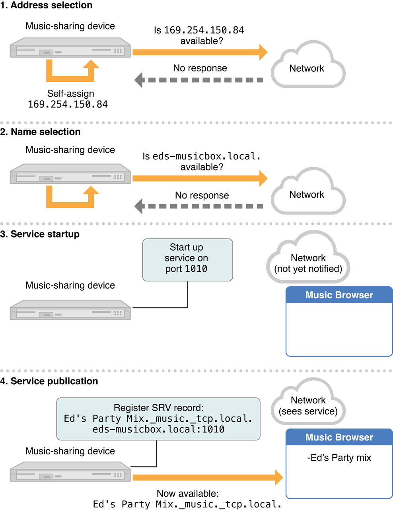
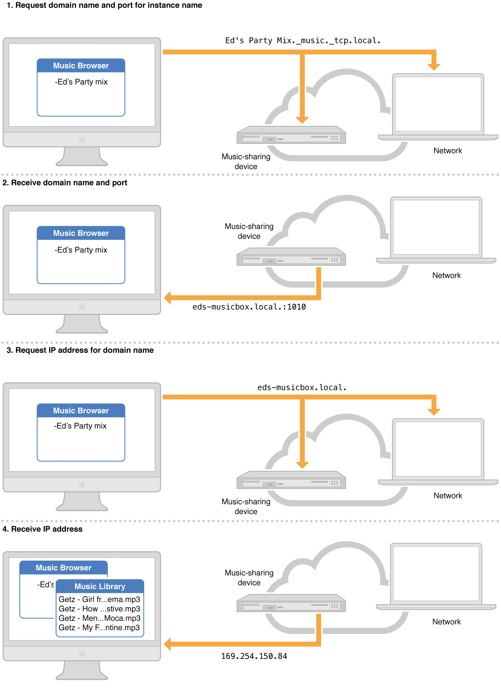

Bonjour 操作
===
[原文地址](https://developer.apple.com/library/ios/documentation/Cocoa/Conceptual/NetServices/Articles/NetServicesArchitecture.html#//apple_ref/doc/uid/20001074-SW1)

翻译人:彭兆旻 日期:2015.10.14

本章介绍服务的发布,浏览,解析,这三个网络服务 API 和它们底层的 Bonjour 操作,如果你想要写一个应用程序或者工具来发布或者发现网络服务的话你应该阅读本章.

###体系结构概述

在 Bonjour 的网络服务体系中包含一个易于使用的机制,用于发布,发现和使用基于 IP 的服务. Bonjour 支持三个基础操作,其中的每个都是零配置网络服务的必要部分.

* 发布 (广播一个服务)
* 发现 (浏览可用的服务)
* 服务解析 (将服务名称转换成服务的地址和端口)

以下的章节会详细讨论这些操作的细节.

### 发布

若要发布一个服务,APP 或者设备必须保证注册了多播 DNS 服务,通过一个高级的 API 或者联机响应程序 (`mDNSResponder`). Bonjour 还支持传统的 DNS 服务存储记录,使用动态 DNS 更新.

当注册了一个服务,三个相关的 DNS 记录被创建出来:一个服务 (SRV) 记录,一个指针 (PTR) 记录,还有一个文本 (TXT) 记录.文本记录包含解决或者使用服务的额外数据,尽管它常常是空的.

### 服务记录

SRV 记录将服务的名称映射到客户端所需要的信息上,去使用实际的服务.然后,客户端会存储这个服务名称作为持续的方式去连接服务,当要连接的时候,发起一个查询主机名称和端口号的 DNS 查询请求.这一个额外的间接寻址方式提供了两个重要的特征.首先,服务是通过一个好识别的名字来标识的,而不是域名或者端口号.其次,客户端在即使端口号,IP 地址或者主机名改变的情况下,也可以连接服务只要服务的名称保持不变.

SRV 记录包含两条信息来标识服务:

* 主机名
* 端口号

主机名就是域名在哪里可以找到服务.之所以返回一个主机名而不是一个 IP 地址,是因为主机可以是具有多个 IP 地址的多宿主主机.或者主机有 IPV6 和 IPV4 两个地址.通过主机名来定位,可以优雅完美的处理这些情况.

端口号用来识别服务的 UDP 或者 TCP 的端口号.

SRV 是根据以下约定来命名的:

<`Instance Name`>.<`Serivce Type`>.<`Domain`>

<`Instance Name`> 服务的名称,可以是任意的 UTF-8 编码的 Uincode 的字符串,目的是增加可读性.

<`Service Type`> 是一个标准的 IP 协议名称,前面加上划线,接着是主机到主机的通信协议 (TCP 或者 UDP),也是前面加下划线.例如,一个 Trivial FTP 服务使用 UDP 服务类型是 `_tftp._udp`, 一个 IPP 打印服务使用 TCP 协议使用 `_ipp._tcp`服务类型注册.由 IANA 维护的正式协议名称列表.更多的信息参见 [Domain Naming Conventions](https://developer.apple.com/library/ios/documentation/Cocoa/Conceptual/NetServices/Articles/domainnames.html#//apple_ref/doc/uid/TP40002460-SW1).

<`Domain`>是一个标准 DNS 域名.可以使一个具体的域名,比如 `apple.com`,或者是 `local`的通用后缀.仅访问本地线路上的服务.

下来是SRV 记录(标准 DNS 记录格式)的例子,一个名字为 `PrintsAlot`的打印机服务,运行在 `515:`的 TCP 端口号 `PrintsAlot._printer._tcp.local. 120 IN SRV 0 0 515 blackhawk.local`.

这个记录创建在,名字为 `blackhawk.local`的打印机的多播 DNS 响应程序上,,在本地连接上.最初的 120 表示用来缓存的生存时间值 (TTL).两个零是权重和优先级的值,被用来在传统的 DNS 上,从多个记录中选择匹配的名称;为了多播 DNS 的目的,这些值被忽略.

关于域名,服务和实例名的更多信息,请参见 [Domain Naming Conventions](https://developer.apple.com/library/ios/documentation/Cocoa/Conceptual/NetServices/Articles/domainnames.html#//apple_ref/doc/uid/TP40002460-SW1).

###指针记录

PTR 记录,通过将服务的类型解析成运行该服务的实例名称,来实现发现服务的功能.这个记录通过增加一层间接,这样只要寻找服务类型内标记的 PTR 指针就可以找到服务.

这个记录只包含一个信息,就是服务实例的名称(就是和 SRV 记录的名称一样). PTR 记录的命名像 SRV 记录一样但是没有实例名称:

<`Service Type`>.<`Domain`>

下面是一个 PTR 记录的例子,一个名字叫 `PrintsAlot`的打印程序.
`_printer._tcp.local. 28800 PTR PrintsAlot._printer._tcp.local.`

再次说明,28800 是生存时间的值(TTL),以秒记.

###文本记录

TXT Record 与 SRV Record 的名称一致,并且可以包含少量的关于服务的额外信息,通常不会超过 100-200字节.这个记录也可以为空.例如说,一个多人网络游戏可以加上游戏的地图名字,一个聊天程序可以加上一个用户的状态（例如空闲、离开或者在线).如果你需要传输大量的数据,主机会建立一个与客户端的连接来直接发送数据.

根据往常,此记录已经被用于多个服务,运行在同一个端口同一个 IP 地址.例如,多个打印服务运行在一台打印机上.在这种情况下,TXT 记录里额外的信息被用来标识,在打印队列里等待着的需求,体现在下面例子中:

**表4-1 使用 TXT 记录进行多路化**

这种做法是必要的,因为服务类型历来都是与众所周知的端口号相关联.一个新的 Bonjour 协议的设计者需要运行每个实例,在动态分配端口号的情况下.而不是试图去让他们运行在相同的周所周知的端口号上,并且使用额外的信息来指定哪个客户端的实例来建立连接.

TXT Record中的数据对于每种服务都是特定的性质和格式.所以说每一个新的服务类型需要去定义数据的格式,与 TXT 记录关联(如果有的话),并将这种格式的发布作为协议规范的一部分.

###发布：一个范例

对于一个具体的例子,思考一个假设的装置在本地网络上共享音乐,一个 IP 自动点唱机.假设传输协议是 TCP ,应用协议的名称的`music`.当有人将设备插入以太网的集线器时,我们在图 4-1 中看看有什么事情发生.

第一步中,设备随机选择了本地 IP 地址 `169.254.150.84`,通过 IPV4 本地链路范围 `169.254.0.0`中随机抽取,子网掩码是`255.255.0.0`.并告诉网络.因为没有设备响应这个通知,这个设备就将这个地址作为自己的地址.第二步,它启动自己的多播 DNS 响应程序,请求主机名 `eds-musicbox.local.`,来验证它的可用性,并把这个名字自己使用.接下来,第三步里,设备启动一个音乐共享服务在 TCP 1010 端口.最后,在第四步里,它发布了这个服务,类型  `_music._tcp`,名称是 `Ed’s Party Mix`,在 `local`.域名,首先确保不存在相同名称的服务.这会创建两个记录:

* 一个 名称为 `Ed’s Party Mix._music._tcp.local.` 的 SRV 记录,指向 `eds-musicbox.local.` 在 TCP 端口 1010.
* 一个 名称为 `_music_tcp.local.` 的 PTR 记录,指向 `Ed’s Party Mix._music._tcp.local.` 服务.

**图 4-1 发布一个音乐共享服务**

>当发布一个服务,如果域名或者服务名不易得到,一个没有接口的设备可以选择一个新的名称. APP 遇到这种情况应该给用户提供一个界面,说明名称不可用,并且应该允许用户选择另外一个名称.

###发现

发现服务,使用在服务发布期间注册的 DNS 记录,来找到特定的服务类型的名称实例.要做到这一点,应用程序对 PTR 记录执行查询,来匹配服务类型.例如 `_http._tcp`,通常是通过一个更高层次的 API.多播 DNS 响应程序运行在每个设备上,返回 PTR 记录和服务的实例名称.

**图 4-2 发现音乐共享服务**

图 4-2 说明了一个浏览音乐共享服务的客户端程序.第一步,客户端发起一个在本地的查询类型,`_music._tcp`.标准的多播地址域 `224.0.0.251`.每一个在网络上的多播 DNS 响应程序都听到了这个请求,但是只有音乐共享设备返回其一个 PTR 记录(只是第二步).返回的 PTR 记录携带服务实例名称,`Ed's Party Mix._music._tcp.local.`.在这种情况下,客户端程序就可以从 这个 PTR 记录中提取到服务的实例名称,并且把它添加到屏幕中得音乐服务列表中.

###解析

发现服务通常都是偶尔发生的,例如,当一个用户第一个选择一个打印机.这个操作会保存这个服务实例名称,打算固定标识符对任何给定的服务实例.端口号,IP 地址,甚至主机名天天都可以变,但是当它每次改变的时候,用户并不需要去选择打印机.因此,除非服务真的被用到了,服务名称到 socket 信息的决议并不会发生.

若要解析一个服务,APP 对 SRV 服务名称的记录发起一个 DNS 查询.多播 DNS 响应程序的 SRV 记录会包含当前的信息.

图 4-3说明了在音乐共享示例中的服务解析.解析的过程开始于一个 DNS 请求,对多播地址 `224.0.0.251`,请求 `Ed’s Party Mix._music._tcp.local.` SRV 记录,这是第一步.在第二步里,此查询返回服务的主机名和端口号 (`eds-musicbox.local., 1010`). 在第三步,客户端对 IP 地址发送一个多址广播请求.第四步,这个请求解析到 IP 地址 `169.254.150.84`. 然后可以使用这个 IP 地址和端口号连接服务.这一过程发生在每次使用服务的时候,从而总是找到服务最新的地址和端口号.

**图 4-3 解析音乐共享服务实例**

