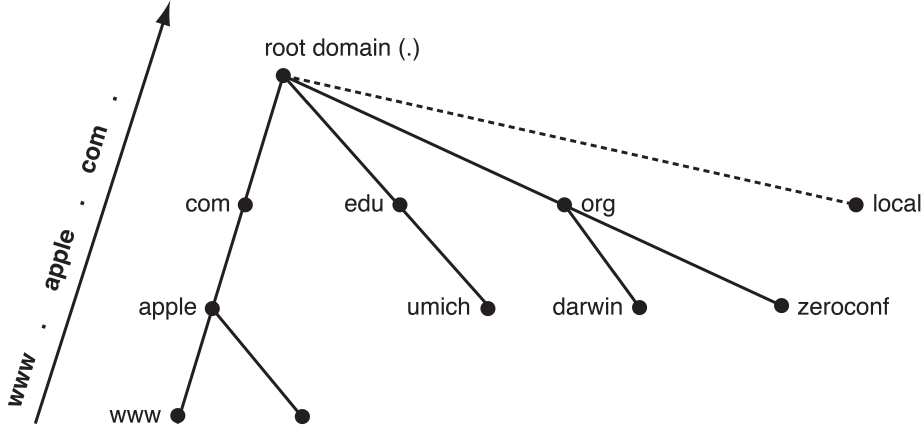
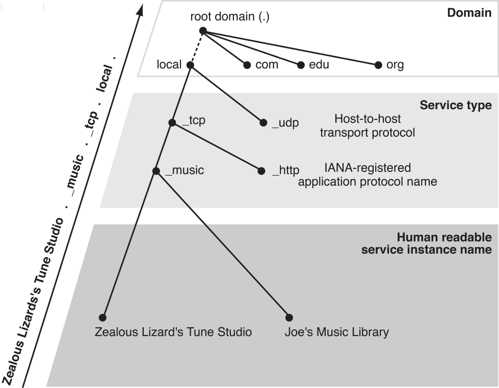

#域命名约定

[原文地址](https://developer.apple.com/library/ios/documentation/Cocoa/Conceptual/NetServices/Articles/domainnames.html#//apple_ref/doc/uid/TP40002460-SW1) 

 翻译人:王谦 翻译日期:2015.10.9
 

Bonjour 名称服务实例和服务类型相关域名系统(DNS)域名。这是部分 DNS 域名说明。Bonjour 当地“域”的命名规则 Bonjour 服务实例和服务类型。

##域名和 DNS

DNS为域名使用一个由特殊到一般的命名方案。大多一般的域名是 .(“点”),被称为根域,这是类似于在一个 / UNIX 文件系统根目录。
其他域下降一个等级低于根域。举一个例子,名称是 `www.apple.com.` 是第二级别的域 `apple.com.` 在顶级域名com。,反过来的一部分。(“点”),根域。图 2-1 显示了一个简化版本的层次结构。

图 2-1 互联网域名系统的一部分,增强 Bonjour

在倒树的顶部是根域。在下面它是一些顶级域:`com.`,`edu.`,和 `org.`,和本地 Bonjour “域” `local.`,更进一步的讨论在[Bonjour and the Local Link]。

[Bonjour and the Local Link]:
https://developer.apple.com/library/ios/documentation/Cocoa/Conceptual/NetServices/Articles/domainnames.html#//apple_ref/doc/uid/20001072-202537

您可能已经注意到,大多数域名的拖曳点是离开。落后点,然而,有意义。一个域名在拖曳点结束,如 `www.apple.com.`,被称为一个完全限定域名,就像一个绝对路径( 如 /usr/bin )在UNIX文件系统。

如果你的类型`wibble.apple.com` 进入你的web浏览器内(没有落后于点),系统把它作为不合格(部分)名称和附加的名字从你的名单的搜索域,如`example.com.`, `example.edu`,等等。系统首先尝试添加`.`(“点”,根域),但是如果名字 `wibble.apple.com.`不存在,它继续沿着列表和尝试`wibble.apple.com.example.com.`, `wibble.apple.com.example.edu.`,等等。虽然这个搜索域特性通常是有用的,在这种情况下它可能不是你想要的。

##Bonjour ,和当地的链接

Bonjour 协议在很大程度上应对网络称为本地链接的一部分。在主机本地连接, 或者本地网络连接,包括自己和所有其他主机,可以交换数据包没有IP报头数据被修改。在实践中,这包括所有主机不是由一个路由器。

在 Bonjour 系统,`local.` 是用来表示一个名字,应该使用IP多路广播在本地IP网络查询。

注意`local.`不是真正的域。你可以认为`local.`是一个伪域。它有别于传统 DNS 域的基本方法:在其他领域是全球独一无二的名字;不链接本地域名。只有一个逻辑 DNS 条目在世界上叫`www.apple.com.`,因为DNS的工作方式,只能有一个。在本地主机名结束,另一方面,是由一组多路广播 DNS 响应器在本地网络上,所以命名范围是:本地。在这里可以很容易地给两个主机命名`meow.local.`在世界上,甚至同一座楼里,不是在同一个本地网络。

在全球独一无二的名字是非常重要的，事实上是有用的,他们是互联网的重要成就之一,他们需要一定程度的管理努力建立和维护。当地的名字只在本地网络上是有用的,但在适当的情况下,它提供了一种方法,是指网络设备使用的名字而不是 IP 数字,当然他们需要更少的精力和费用协调全局唯一的名字。

本地独特的名字特别是用在网络没有连接到全球互联网,通过设计或中断,在小,临时网络,比如一对交叉电缆相关的电脑,或几个人玩网络游戏使用笔记本电脑的无线网络家庭或咖啡馆。

如果发生名称冲突在本地网络,Bonjour 主机自动发现一个新名字(在 iOS 或任何设备的情况下没有一个屏幕)或通过询问用户(个人电脑)。

##Bonjour 和单一传播 DNS

在添加多路广播 DNS, Bonjour 支持广告和发现服务比传统的单播 DNS 使用广域 Bonjour。单播 DNS 超出了本文的范围。想要了解更多关于配置为使用单播域名服务器 Bonjour,看[DNS-SD website]。

[DNS-SD website]:
http://www.dns-sd.org/ServerSetup.html

##Bonjour 现有服务类型名称

Bonjour 命名服务是根据现有的 IP 网络标准服务( RFC 2782 中描述)。Bonjour,服务名称服务类型和传输协议结合,形成一个注册类型。登记类型是用来注册一个服务和创建 DNS 资源记录。从DNS 域名资源记录区分登记类型,登记类型使用下划线前缀单独组件组成一个登记类型。的格式是

_ServiceType._TransportProtocolName.

服务类型是官方 IANA-registered 名称服务,例如,`ftp`,`http` 或`printer`。tcp 或 udp 传输协议名称,根据服务使用的传输协议。FTP 服务运行在 TCP 将登记 `_ftp._tcp` 类型。并将注册一个DNS命名`_ftp._tcp.local.` PTR记录。与主机的多路广播 DNS 响应者。

##Bonjour 名字为新服务

如果设计一个新的协议通知一个 Bonjour 网络服务,你应该注册它和[IANA]。

[IANA]:
http://www.iana.org/form/ports-services

目前 IANA 要求每个已注册的服务被关联到一个著名的港口或一系列著名的港口。例如, http 是分配端口 80,这样当你在您的 web 浏览器中访问一个网站时,假定 http 服务的应用程序运行在端口 80 上,除非你指定。网站的端口号需要记住，如果该网站是在一个非标准的方式配置的。

Bonjour,然而,你不需要知道端口号。因为客户端应用程序可以用一个简单的查询发现您的服务的服务类型,已知好的端口是不必要的。

##Bonjour 服务实例的名称

服务实例名称的目的是字符串让人易读。因此,你应该叫他们叙述地,让用户覆盖任何你提供的缺省名称。因为他们是浏览,而不是类型,服务实例的名称可以是任何 Unicode 字符串和 utf - 8 编码,多达63个八位字节的长度(字节)。

例如,应用程序通过网络共享音乐可能使用本地用户的名字音乐共享服务,如 Emille 的音乐库,默认情况下。用户可以覆盖默认的名字服务热心的 `Zealous Lizard's Tune Studio`,和应用程序将注册一个DNS SRV记录`Zealous Lizard's Tune Studio._music._tcp.local.`而命名。假设应用程序的音乐分享协议与名字有关的音乐。

图 2-2 说明了组织 Bonjour 服务实例的名称。在树的顶级域,如本地。本地网络。以下域名注册类型,它由之前的服务类型下划线( _music )和传输协议,之前还一个下划线( _tcp )。底部的树是人类可读的服务实例的名称,比如狂热的蜥蜴的曲调工作室。完整的名称是一个路径沿着树从下到上,每个组件由一个点分开。

图 2-2 组织 Bonjour 服务名称

