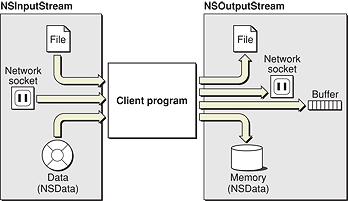

#Cocoa 流

[原文地址](https://developer.apple.com/library/ios/documentation/Cocoa/Conceptual/Streams/Articles/CocoaStreamsOverview.html#//apple_ref/doc/uid/20002272-BABJFBBB) 

 翻译人:王谦 翻译日期:2015.10.2
 
 流为程序提供一个简单的方法在一个单独设备途径中与各种媒体交换数据。流是一个在一个通信路径之上相连的序列连续的二进制传输。因此它是单向的,从程序的角度来看,一个流可以是输入(或者读取)流或一个输出(或写入)流。除了 file-based 流,流是 non-seekable—once 流数据提供或消耗,它不能从流中再次恢复。

Cocoa 描述三个流相关的类: `NSStream`, `NSInputStream` 和 `NSOutputStream`。`NSStream` 是一个抽象的类定义的基本类型接口 和流对象的全部属性。`NSInputStream ` 和 `NSOutputStream ` 是 `NSStream` 的子类和实现默认的输入流和输出流的行为。你可以创建`NSInputStream ` 实例位于流数据的内存或写入到文件或缓冲区;你可以创建 `NSInputStream `实例来自`NSData` 对象或文件的读取流数据。你也可以让`NSInputStream`和`NSOutputStream`对象的端点基于 socket-based 的网络连接,您可以使用流对象不加载所有的流数据到内存中。图1演示了输入流和输出流对象类型的来源或目的地。

**图1** 流对象的来源或目的地

因为他们处理这样一个基本的计算抽象（流),`NSStream` 和它的子类是用于底层编程任务。如果有更高级的 Cocoa  API 更适合一个特定的任务( `NSURL` 或 `NSFileHandle` )使用它来代替。

流对象有和他们关联的属性。大多数属性与网络安全和配置,也就是 secure-socket (SSL) 层次和 SOCKS 代理信息。两个重要的额外属性是[NSStreamDataWrittenToMemoryStreamKey](),它允许检索数据输出流写入内存,和 `NSStreamFileCurrentOffsetKey`,它允许您操作当前读取或写入 file-based 流的位置。

一个流对象有一个代理和它关联。如果一个委托不明确,流对象它本身成为一个代理(一个有用的约定的自定义子类)。流对象调用代理的唯一方法`stream:handleEvent:`为每个 stream-related 事件处理。特别重要的是事件表明当字节可以从输入流和输出流读取信号时,准备接受字节。这两个事件,委托发送相应的消息流 - `read:maxLength:` 或  `write:maxlength:`,依赖流的类型 - 要从流中获取字节或在流上放置字节。

`NSStream` 是建立在 `CFStream` 层的核心基础。这是结束关联的方法在于 `NSStream `的具体子类,`NSOutputStream `和`NSInputStream `,`CFWriteStream `和 `CFReadStream `是 toll-free 的网桥方式和他们对应的核心基础。虽然有很强的相似性Cocoa 和核心基础流 API,他们的实现并不完全重合。Cocoa 流类使用异步行为的委托模型(假设 run-loop 调度),而核心基础使用客户端回调。
核心基础流类型设置客户端(称为上下文核心基础)不同 NSStream 设置代理;不应该混合调用设置委托调用上下文。否则你可以自由混和两个 api 的调用代码。

尽管他们强力的相似性,`NSStream` 对 `CFStream` 给你一个大的优势。因为它的 Objective-C 的基础,它是可扩展的。你可以子类`NSStream`、`NSInputStream`或`NSOutputStream`定制流属性和行为。例如,您可以创建一个输入流,维护统计数据读入的字节数,或者你可以做一个`NSStream`子类的实例可以寻求通过流,将字节读取。`NSStream`都有自己的一组需要重写,`NSInputStream`和`NSOutputStream`。看到`NSStream`的参考文档,`NSInputStream `和`NSOutputStream`有关这些类子类化。