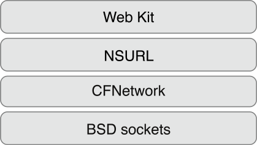
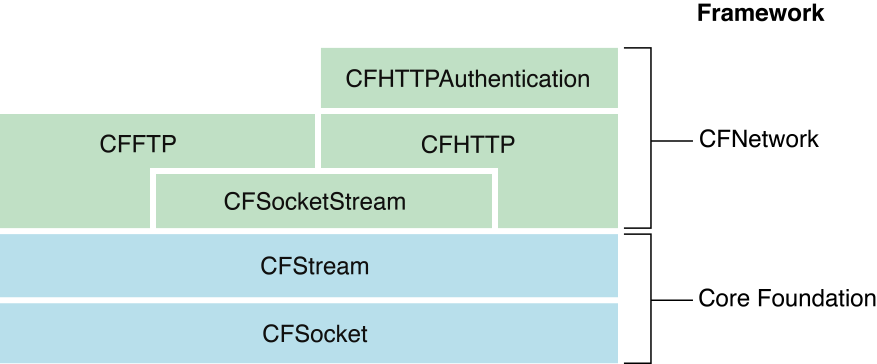
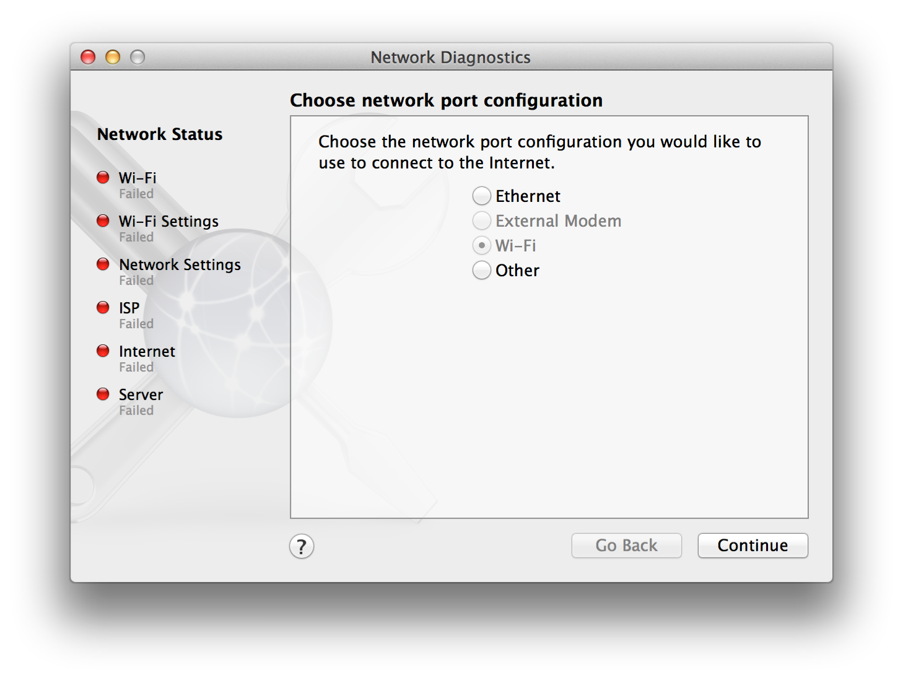

#CFNetwork 概念

[原文地址](https://developer.apple.com/library/prerelease/mac/documentation/Networking/Conceptual/CFNetwork/Concepts/Concepts.html#//apple_ref/doc/uid/TP30001132-CH4-SW10)
翻译人: 王谦 日期: 2015.9.9

CFNetwork 是一个低级的、高性能的框架,使您能够详细的控制协议栈。BSD socket 是一个扩展,提供对象的标准 socket 抽象 API 来简化任务,比如与 FTP 和 HTTP 服务器或沟通解决 DNS 主机。CFNetwork 为基础,从主体上和理论上, 为 BSD 套接字。

正如 CFNetwork 依赖于 BSD socket ,有大量的 Cocoa 类依赖CFNetwork (例如, NSURL )。此外, Web 工具包是一组 Cocoa 类在窗口中显示网页内容。这两个类是非常高的水平,实现大部分的网络协议的细节。因此,软件层的结构看起来像图像如图1 - 1所示。

**图1 - 1在OS X CFNetwork和其他软件层**

##何时使用CFNetwork

CFNetwork 在 BSD socket 有许多优点。它提供 run-loop 集成,因此,如果您的应用程序是基于run loop 可以使用网络协议用不着实现线程。CFNetwork 还包含大量的对象来帮助你使用网络协议,而无需自己实现细节。例如,您可以使用 FTP 协议无需 CFFTP API 实现的所有细节。如果你理解网络协议,需要他们提供的低级控制但不想实现自身,然后 CFNetwork 可能是正确的选择。

有许多优势,使用 CFNetwork 代替基础水平网络 api 。CFNetwork 更侧重于网络协议,而基础水平更侧重于数据访问 api,比如通过 HTTP 或 FTP 传输数据。虽然基础 api 提供了一些可配置性, CFNetwork 提供更多。基础网络课程的更多信息,阅读 [URL Loading System Programming Guide](https://developer.apple.com/library/prerelease/mac/documentation/Cocoa/Conceptual/URLLoadingSystem/URLLoadingSystem.html#//apple_ref/doc/uid/10000165i).

现在开始了解 CFNetwork 交互与其他 OS X 网络 api ,准备熟悉 CFNetwork api 以及两个api ,形成 CFNetwork 的基础设施。

##CFNetwork基础结构

在学习 CFNetwork api 之前,你必须首先理解的大部分 CFNetwork api 的基础。CFNetwork是依赖两个 api 的核心基础框架组成的,CFSocket 和 CFStream。理解这些 api 使用 CFNetwork 至关重要。

###CFSocket API

Sockets 是最基本的网络通信。一个 socket 以类似电话的方式。它允许您连接到另一个 socket (本地或通过网络)和 socket 发送数据。

最常见的 socket 抽象是 BSD socket 。CFSocket是一个抽象的 BSD socket 。非常小的开销,CFSocket BSD socket 提供了几乎所有的功能,并集成了 socket 变成一个 run-loop 。 CFSocket  并不局限于基于 socket 流(例如 TCP ),它可以处理任何类型的 socket。

你可以从头创建一个 CFSocket 对象使用 [CFSocketCreate](https://developer.apple.com/library/prerelease/mac/documentation/CoreFoundation/Reference/CFSocketRef/index.html#//apple_ref/doc/c_ref/CFSocketCreate) 函数,或从一个 BSD socket 使用 [CFSocketCreateWithNative](https://developer.apple.com/library/prerelease/mac/documentation/CoreFoundation/Reference/CFSocketRef/index.html#//apple_ref/doc/c_ref/CFSocketCreateWithNative) 函数。然后,您可以使用该函数创建一个 run-loop 源 [CFSocketCreateRunLoopSource](https://developer.apple.com/library/prerelease/mac/documentation/CoreFoundation/Reference/CFSocketRef/index.html#//apple_ref/doc/c_ref/CFSocketCreateRunLoopSource) 并将它添加到 [CFRunLoopAddSource](https://developer.apple.com/library/prerelease/mac/documentation/CoreFoundation/Reference/CFRunLoopRef/index.html#//apple_ref/doc/c_ref/CFRunLoopAddSource) run-loop 的功能。这将允许你 CFSocket 回调函数运行 CFSocket 对象时接收一条消息。

读  [CFSocket Reference](https://developer.apple.com/library/prerelease/mac/documentation/CoreFoundation/Reference/CFSocketRef/index.html#//apple_ref/doc/uid/20001445) 有关 CFSocket API 的更多信息。

###CFStream API

读取流 和 写入流 提供一种简单的方法从各种媒体中交换数据和方式设备无关。您可以创建数据流位于内存中,在一个文件中,或者在一个网络(使用 socket ),你可以使用数据流，而不必将所有数据加载到内存中去。

流是一个字节序列传输串行通信路径。流是单向路径,所以双向沟通的一个输入(阅读)流和输出(写入)流是必要的。除了基于文件流,你不能寻求在一个流;一旦流数据被提供或消费,又无法获取它的流
 CFStream 是一个 API ,它提供了一个抽象为这些流有两个新的 CFType 对象: CFReadStream  CFWriteStream 。这两种类型的流 API 的规范遵循所有常见的核心基础。关于核心基础类型的更多信息,阅读[Core Foundation Design Concepts](https://developer.apple.com/library/prerelease/mac/documentation/CoreFoundation/Conceptual/CFDesignConcepts/CFDesignConcepts.html#//apple_ref/doc/uid/10000122i)。

CFStream 是建立在 CFSocket , CFHTTP 和 CFFTP 的基础。如图1 - 2中可以看出,尽管 CFStream 不是正式 CFNetwork 的一部分,它是几乎所有 CFNetwork 的基础。

**Figure 1-2  CFStream API 结构**

您可以使用读写流像 UNIX 文件一样的描述符。首先,您通过指定实例化流的流型(内存、文件或套接字)和设置任何选项。接下来,您打开流和读或写任何的次数。而流存在,你可以要求其属性的流信息。流属性是任何关于流的信息,比如它的源或目标,不是实际数据被读取或写入的一部分。当你不再需要流,关闭并处理它。

CFStream 读或写的函数流将暂停,或块,当前进程,直到至少有一个数据可以读取或写入的字节。为了避免试图读取或写入一个流流将阻止时,使用异步版本的功能和进度上的流循环运行。你的回调函数被调用时可能没有阻塞读和写。

此外, CFStream 内置支持安全 socket 层( SSL )协议。您可以设置一个字典包含流的 SSL 信息,如所需的安全级别或自签名证书。然后将它传递给你的流 kCFStreamPropertySSLSettings 制造 SSL 流。

本章使用 [Working with Streams](https://developer.apple.com/library/prerelease/mac/documentation/Networking/Conceptual/CFNetwork/CFStreamTasks/CFStreamTasks.html#//apple_ref/doc/uid/TP30001132-CH6-SW1) 如何使用读写流。

##CFNetwork API概念

要理解 CFNetwork 框架,您需要熟悉 blocks 的构建组成。CFNetwork 框架分解成单独的 api ,每个覆盖特定的网络协议。这些 api 可用于组合,或分开,这取决于您的应用程序。大多数的编程约定 api 中是常见的,因此,重要的是理解。

###CFFTP API

沟通与CFFTP FTP服务器变得更加容易。使用 CFFTP API ,您可以创建 FTP 读流(下载)和 FTP 写流(上传)。使用FTP读写流可以执行等功能。

* 从一个 FTP 服务器下载一个文件

* 上传文件到 FTP 服务器上

* 从一个 FTP 服务器下载目录清单

* 在 FTP 服务器上创建目录

FTP 流就像所有其他 CFNetwork 流。例如,您可以创建一个 FTP 读取流`CFReadStreamCreateWithFTPURL` 函数通过调用函数。然后,您可以调用该函数`CFReadStreamGetError` 随时检查流的状态。

通过设置 FTP 流上的属性时,您可以调整您为其特定的应用程序流。例如,如果流的服务器连接到需要用户名和密码,您需要设置适当的属性所以流可以正常工作。关于不同属性的更多信息可看 [Setting up the Streams](https://developer.apple.com/library/prerelease/mac/documentation/Networking/Conceptual/CFNetwork/CFFTPTasks/CFFTPTasks.html#//apple_ref/doc/uid/TP30001132-CH9-SW2)。

CFFTP流可以使用同步或异步。打开连接的FTP服务器创建时指定FTP读取流,`CFReadStreamOpen`调用的函数。从流读取,使用`CFReadStreamRead`函数并提供读取流参考,`CFReadStreamRef`,返回FTP读取流时创建的。`CFReadStreamRead`函数填充和FTP服务器的输出缓冲区。

使用CFFTP更多信息,请看 [Working with FTP Servers](https://developer.apple.com/library/prerelease/mac/documentation/Networking/Conceptual/CFNetwork/CFFTPTasks/CFFTPTasks.html#//apple_ref/doc/uid/TP30001132-CH9-SW1)。

###CFHTTP API

发送和接收 HTTP 消息,使用 CFHTTP API 。正如 CFFTP 是一个抽象的 FTP 协议, CFHTTP 是 HTTP 协议的一个抽象。

超文本传输协议( HTTP )请求 / 响应协议客户端和服务器之间。客户端创建一个请求消息。这个消息被序列化,这一过程将消息转换为原始字节流。消息不能传播,直到他们被序列化。然后请求消息发送到服务器。请求通常要求一个文件,如网页。服务器响应发送回一个字符串消息紧随其后。这个过程重复多次是必要的。

要创建一个HTTP请求消息,您指定以下:

* 请求方法,可以请求方法定义的超文本传输协议,如`GET, HEAD, POST, PUT, DELETE, TRACE,和CONNECT`

* URL,如http://www.apple.com

* HTTP版本,比如版本1.0或1.1

* 消息的标题,通过指定的标题名称,如User-Agent,和它的value,如MyUserAgent

* 消息的 body

消息后,你序列化。请求序列化后,看起来像这样:

 >GET / HTTP/1.0\r\nUser-Agent: UserAgent\r\nContent-Length: 0\r\n\r\n

反序列化是序列化的反面。反序列化,从客户端或服务器接收到的原始字节流恢复其原生的表示。 CFNetwork 提供所有功能需要得到消息类型(请求或响应)、HTTP 版本, URL ,标题,和传输流,序列化消息。

更多的例子在[Communicating with HTTP Servers](https://developer.apple.com/library/prerelease/mac/documentation/Networking/Conceptual/CFNetwork/CFHTTPTasks/CFHTTPTasks.html#//apple_ref/doc/uid/TP30001132-CH5-SW2)。

###CFHTTPAuthentication API

如果你发送一个 HTTP 请求身份验证服务器没有凭证(或用不正确的凭证),服务器将返回一个授权的要求(俗称401或407响应)。CFHTTPAuthentication API HTTP 消息身份验证凭证适用于一些要求。 CFHTTPAuthentication 支持以下身份验证方案:

* Basic

* Digest

* NT LAN Manager (NTLM)

* Simple and Protected GSS-API Negotiation Mechanism (SPNEGO)

新的在 OS X v10.4 上携带持久性跨域请求的能力。在 OS X v10.3 每次请求受到要求,你必须从头开始身份验证对话框。现在,你为每个服务器维护一组 CFHTTPAuthentication 对象。当你收到一个401或407响应,您找到正确的对象和凭证的服务器和应用它们。 CFNetwork 使用信息存储在对象尽可能高效地处理请求。

通过持续在请求时,这个新版本的CFHTTPAuthentication提供更好的性能。更多的信息关于如何使用CFHTTPAuthentication请看[Communicating with Authenticating HTTP Servers](https://developer.apple.com/library/prerelease/mac/documentation/Networking/Conceptual/CFNetwork/CFHTTPAuthenticationTasks/CFHTTPAuthenticationTasks.html#//apple_ref/doc/uid/TP30001132-CH8-SW1)。

###CFHost API

你使用 CFHost API 获取主机信息,包括名字,地址,和可达性信息。获取信息的过程称为resolution。

* 使用CFHost 就像CFStream一样:

* 创建一个CFHost对象

* 开始解决CFHost对象。

* 检索的地址、主机名、或可达性信息
当你完成的时候摧毁CFHost对象。

像所有 CFNetwork CFHost IPv4 和 IPv6 是兼容的。使用 CFHost ,您可以编写代码来处理 IPv4 和 IPv6。

CFHost 集成与 CFNetwork 的其余部分。例如,有 CFStream 名为[CFStreamCreatePairWithSocketToCFHost](https://developer.apple.com/library/prerelease/mac/documentation/CoreFoundation/Reference/CFSocketStreamRef/index.html#//apple_ref/doc/c_ref/CFStreamCreatePairWithSocketToCFHost) 的函数将直接从 CFHost 创建一个 CFStream 对象。关于 CFHost 对象功能的更多信息，看[CFHost Reference](https://developer.apple.com/library/prerelease/mac/documentation/CoreFoundation/Reference/CFSocketStreamRef/index.html#//apple_ref/doc/c_ref/CFStreamCreatePairWithSocketToCFHost)。

###CFNetServices API

如果你想让你的应用程序使用 Bonjour 注册一个服务或发现服务,使用 CFNetServices API 。 Bonjour 是苹果的zero配置网络的实现( ZEROCONF ),它允许您发布、发现和解决网络服务。

实现你好 CFNetServices API 定义了三个对象类型: CFNetService  CFNetServiceBrowser, CFNetServiceMonitor 。 CFNetService 对象代表一个单一的网络服务,如打印机或文件服务器上。它包含所有所需的信息对于服务器的另一台计算机来解决,如名称、类型、域和端口号。CFNetServiceBrowser 对象被用来发现领域内域和网络服务。和 CFNetServiceMonitor 对象用于监视 CFNetService 对象的变化,如 iChat 状态消息。

Bonjour完整的描述,请参阅[Bonjour Overview](https://developer.apple.com/library/prerelease/mac/documentation/Cocoa/Conceptual/NetServices/Introduction.html#//apple_ref/doc/uid/10000119i)。关于使用 CFNetServices 的更多信息和实现Bonjour,请看[NSNetServices and CFNetServices Programming Guide](https://developer.apple.com/library/prerelease/mac/documentation/Networking/Conceptual/NSNetServiceProgGuide/Introduction.html#//apple_ref/doc/uid/TP40002736).

###CFNetDiagnostics API

连接到网络的应用程序依赖于一个稳定的连接。如果网络出现故障,这将导致应用程序的问题。采用 CFNetDiagnostics API ,用户可以自诊断网络问题如:

* 物理连接失败(例如,电缆未插入)

* 网络故障(例如, DNS 、 DHCP 服务器不再回应)

* 配置失败(例如,代理配置是不正确的)

一旦网络故障诊断, CFNetDiagnostics 指导用户解决问题。你可能看过 CFNetDiagnostics 行动如果 Safari 未能连接到一个网站。CFNetDiagnostics 可以看到如图1 - 3所示。

**Figure 1-3  网络诊断助手**

通过提供 CFNetDiagnostics 网络故障的上下文中,您可以调用 [CFNetDiagnosticDiagnoseProblemInteractively](https://developer.apple.com/library/prerelease/mac/documentation/CoreFoundation/Reference/CFNetDiagnosticsRef/index.html#//apple_ref/doc/c_ref/CFNetDiagnosticDiagnoseProblemInteractively) 函数引导用户通过提示找到解决的办法。此外,您可以使用 CFNetDiagnostics 查询连接状态和为用户提供统一的错误消息。

看到如何将 CFNetDiagnotics 集成到您的应用程序请看 [Using Network Diagnostics](https://developer.apple.com/library/prerelease/mac/documentation/Networking/Conceptual/CFNetwork/UsingNetworkDiagnostics/UsingNetworkDiagnostics.html#//apple_ref/doc/uid/TP30001132-CH7-SW1)。CFNetDiagnostics 为 OS X v10.4 新的 API 。

