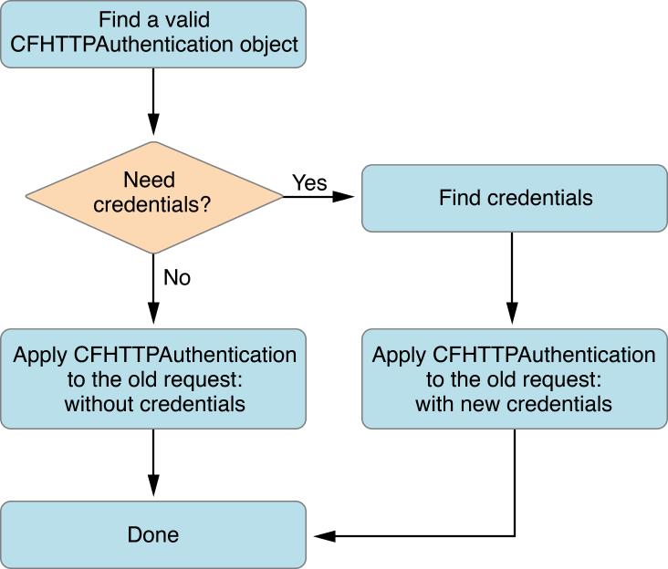
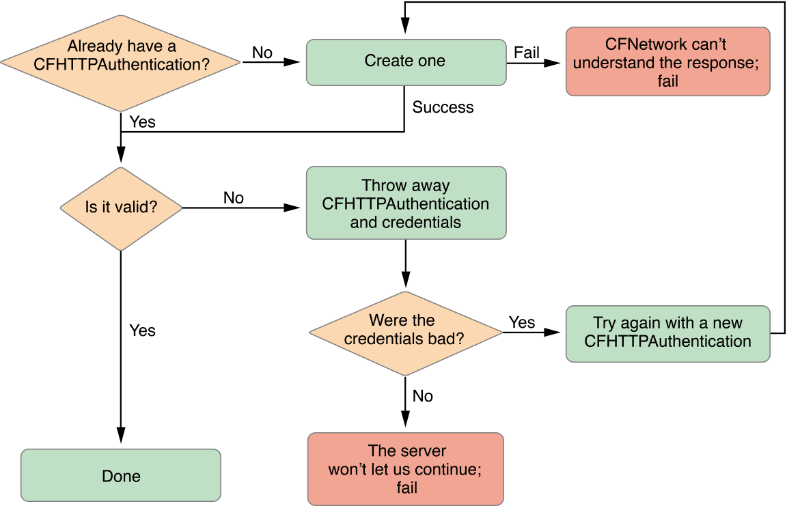

#与HTTP服务器通信认证

[原文地址](https://developer.apple.com/library/prerelease/mac/documentation/Networking/Conceptual/CFNetwork/CFHTTPAuthenticationTasks/CFHTTPAuthenticationTasks.html#//apple_ref/doc/uid/TP30001132-CH8-SW1)
翻译人:王谦 日期:2015.9.10

本章描述了如何与 HTTP 服务器身份验证利用CFHTTPAuthentication API 。它解释了如何找到匹配验证对象和凭证,将它们应用到一个 HTTP 请求,并将它们存储供以后使用。

一般来说,如果一个 HTTP 服务器将返回一个401或407响应后你的 HTTP 请求,这意味着服务器进行身份验证,需要凭证。在 CFHTTPAuthentication API 中,每个组凭证存储在一个 CFHTTPAuthentication 对象。因此,每一个不同的服务器和每个不同的用户连接到服务器进行身份验证需要一个单独的 CFHTTPAuthentication 对象。与服务器通信,需要 CFHTTPAuthentication 对象应用于HTTP请求。更详细地解释了这些步骤。

##处理身份验证

添加支持身份验证将允许您的应用程序和 HTTP 服务器进行身份验证(如果服务器返回一个401或407响应)。尽管 HTTP 身份验证不是一个困难的概念,它是一个复杂的过程来执行。过程如下:

1.客户端向服务器发送一个HTTP请求。

2.服务器给客户端返回一个要求。

3.客户端包凭证的原始请求并将它们发送回服务器。

4.客户端和服务器之间进行协商。

5.当服务器对客户端进行身份验证,它会反回响应请求。

执行这个过程需要许多步骤。图的整个过程如图4 - 1和图4 - 2中可以看到。

**图4 - 1处理身份验证**

**图4 - 2找到一个身份验证对象**

当 HTTP 请求返回一个 401 或 407 响应,第一步是为客户找到一个有效的 CFHTTPAuthentication 对象。身份验证对象包含凭证和其他信息,当应用于HTTP消息请求,与服务器验证你的身份。如果你已经与服务器身份验证一次,你会有一个有效的身份验证对象。然而,在大多数情况下,您将需要创建这个对象与[CFHTTPAuthenticationCreateFromResponse](https://developer.apple.com/library/prerelease/mac/CoreFoundation/Reference/CFHTTPAuthenticationRef/index.html#//apple_ref/doc/c_ref/CFHTTPAuthenticationCreateFromResponse)响应函数。参见清单4。

>注意:所有的示例代码关于身份验证是改编自 ImageClient 应用程序。

**清单4创建身份验证对象**

	
	if (!authentication) {
	    CFHTTPMessageRef responseHeader =
	        (CFHTTPMessageRef) CFReadStreamCopyProperty(
	            readStream,
	            kCFStreamPropertyHTTPResponseHeader
	        );
	 
	    // Get the authentication information from the response.
	    authentication = CFHTTPAuthenticationCreateFromResponse(NULL, responseHeader);
	    CFRelease(responseHeader);
	}

如果新的认证对象是有效的,那么你已经完成,并可以继续第二步的图 [4 - 1]() 。如果身份验证对象不是有效的,然后扔掉身份验证对象和凭证,检查凭证是坏的。关于证书的更多信息,阅读"[Security Credentials](https://developer.apple.com/library/mac/qa/qa1277/_index.html)”。

坏凭证意味着服务器不接受登录信息,它将继续监听新的凭证。然而,如果服务器证书是好的但是仍然拒绝了你的请求,然后服务器拒绝和你说话,所以你必须放弃。假设凭证是坏,重试整个过程开始创建身份验证对象,直到你得到工作凭证和有效的验证对象。在代码中,这个过程应该类似于清单4 - 2。

**清单4 - 2找到一个有效的身份验证对象**

	CFStreamError err;
	if (!authentication) {
	    // the newly created authentication object is bad, must return
	    return;
	 
	} else if (!CFHTTPAuthenticationIsValid(authentication, &err)) {
	 
	    // destroy authentication and credentials
	    if (credentials) {
	        CFRelease(credentials);
	        credentials = NULL;
	    }
	    CFRelease(authentication);
	    authentication = NULL;
	 
	    // check for bad credentials (to be treated separately)
	    if (err.domain == kCFStreamErrorDomainHTTP &&
	        (err.error == kCFStreamErrorHTTPAuthenticationBadUserName
	        || err.error == kCFStreamErrorHTTPAuthenticationBadPassword))
	    {
	        retryAuthorizationFailure(&authentication);
	        return;
	    } else {
	        errorOccurredLoadingImage(err);
	    }
	}
	

现在,您已经有了一个有效的验证对象,继续按照流程图如图[4 - 1]()所示。首先,确定你是否需要凭证。如果你不需要,然后应用到HTTP请求身份验证对象。身份验证对象应用于HTTP请求请看[Listing 4-4]()(`resumeWithCredentials`)。

没有存储凭证(在 [Keeping Credentials in Memory](https://developer.apple.com/library/prerelease/mac/documentation/Networking/Conceptual/CFNetwork/CFHTTPAuthenticationTasks/CFHTTPAuthenticationTasks.html#//apple_ref/doc/uid/TP30001132-CH8-SW6)和 [ Keeping Credentials in a Persistent Store](https://developer.apple.com/library/prerelease/mac/documentation/Networking/Conceptual/CFNetwork/CFHTTPAuthenticationTasks/CFHTTPAuthenticationTasks.html#//apple_ref/doc/uid/TP30001132-CH8-SW5)中解释),获得有效身份证件的唯一方法是通过提示用户。大部分的时间,需要用户名和密码凭据。通过身份验证的对象[CFHTTPAuthenticationRequiresUserNameAndPassword](https://developer.apple.com/library/prerelease/mac/documentation/CoreFoundation/Reference/CFHTTPAuthenticationRef/index.html#//apple_ref/doc/c_ref/CFHTTPAuthenticationRequiresUserNameAndPassword)函数可以看到用户名和密码是必要的。如果凭证需要用户名和密码,提示用户凭证和存储他们的字典。对于一个 NTLM 服务器,证书还需要一个域。之后新凭证,您可以应用身份验证对象使用的HTTP请求`resumeWithCredentials`函数来自[Listing 4-4]()。整个过程如清单4 - 3所示。

>注意:在代码清单,当评论之前成功省略了,这意味着这一行动超出了本文的范围,但是需要实现。这是不同于正常的评论描述正在进行什么操作。

**清单4 - 3找到凭证(如果需要),并应用它们**

	// ...continued from Listing 4-2
	else {
	    cancelLoad();
	    if (credentials) {
	        resumeWithCredentials();
	    }
	    // are a user name & password needed?
	    else if (CFHTTPAuthenticationRequiresUserNameAndPassword(authentication))
	        {
	        CFStringRef realm = NULL;
	        CFURLRef url = CFHTTPMessageCopyRequestURL(request);
	 
	         // check if you need an account domain so you can display it if necessary
	        if (!CFHTTPAuthenticationRequiresAccountDomain(authentication)) {
	            realm = CFHTTPAuthenticationCopyRealm(authentication);
	        }
	        // ...prompt user for user name (user), password (pass)
	        // and if necessary domain (domain) to give to the server...
	 
	        // Guarantee values
	        if (!user) user = CFSTR("");
	        if (!pass) pass = CFSTR("");
	 
	        CFDictionarySetValue(credentials, kCFHTTPAuthenticationUsername, user);
	        CFDictionarySetValue(credentials, kCFHTTPAuthenticationPassword, pass);
	 
	        // Is an account domain needed? (used currently for NTLM only)
	        if (CFHTTPAuthenticationRequiresAccountDomain(authentication)) {
	            if (!domain) domain = CFSTR("");
	            CFDictionarySetValue(credentials,
	                                 kCFHTTPAuthenticationAccountDomain, domain);
	        }
	        if (realm) CFRelease(realm);
	        CFRelease(url);
	    }
	    else {
	        resumeWithCredentials();
	    }
	}
	

**清单4 - 4应用请求的身份验证对象**

	void resumeWithCredentials() {
	    // Apply whatever credentials we've built up to the old request
	    if (!CFHTTPMessageApplyCredentialDictionary(request, authentication,
	                                                credentials, NULL)) {
	        errorOccurredLoadingImage();
	    } else {
	        // Now that we've updated our request, retry the load
	        loadRequest();
	    }
	}
	

##在内存中保留凭证

如果你打算经常与一个认证服务器交流,值得重用凭证来避免提示用户多次服务器的用户名和密码。本节解释的变化应一次性使用身份验证代码(比如在[Handling Authentication]())来存储凭证在内存中以便重用。

重用凭证,有三个数据结构更改你需要让你的代码。

1.创建一个可变的数组来保存所有身份验证对象。

	CFMutableArrayRef authArray;

而不是:
	
	CFHTTPAuthenticationRef authentication;

2.创建一个从身份验证对象映射到凭证使用字典。

	CFMutableDictionaryRef credentialsDict;

而不是:

	CFMutableDictionaryRef credentials;

3.保持这些结构都用来修改当前验证对象和当前凭证。

	CFDictionaryRemoveValue(credentialsDict, authentication);

而不是:

	CFRelease(credentials);

现在,创建 HTTP 请求后,寻找一个匹配的验证对象之前每个负载。一个简单的、非优化方法寻找合适的对象可以是清单4 - 5所示。

**清单4 - 5寻找一个匹配的验证对象**

	CFHTTPAuthenticationRef findAuthenticationForRequest {
	    int i, c = CFArrayGetCount(authArray);
	    for (i = 0; i < c; i ++) {
	        CFHTTPAuthenticationRef auth = (CFHTTPAuthenticationRef)
	                CFArrayGetValueAtIndex(authArray, i);
	        if (CFHTTPAuthenticationAppliesToRequest(auth, request)) {
	            return auth;
	        }
	    }
	    return NULL;
	}

如果身份验证数组有匹配的验证对象,然后检查凭证存储是否正确的凭证也可以。这样做可以防止你不得不再次提示用户输入用户名和密码。找凭证使用[CFDictionaryGetValue](https://developer.apple.com/library/prerelease/mac/documentation/CoreFoundation/Reference/CFDictionaryRef/index.html#//apple_ref/doc/c_ref/CFDictionaryGetValue)函数如清单4 - 6所示。

**清单4 - 6搜索凭证存储**

	credentials = CFDictionaryGetValue(credentialsDict, authentication);

然后应用匹配验证对象和凭证原始HTTP请求并重新发送它。

>警告:不适用的凭证用于HTTP请求接收服务器之前的要求。自从你上次认证时服务器可能改变了,你可以创建一个安全风险。

这些变化,你应用程序将能够在内存中存储身份验证对象和凭证,以备未来使用。

保持持久性存储凭证

在内存中存储凭证可以防止用户不得不重新输入服务器的用户名和密码在这特定的应用程序启动。然而,当应用程序退出时,这些证书将被释放。为了避免失去凭据,将它们保存在一个持久化存储中,每个服务器的证书需要只生成一次。钥匙链是推荐的地方用来存储凭证。即使你可以有多个钥匙,这个文档是指用户的默认密钥链钥匙扣。使用钥匙链意味着身份验证信息,您还可以使用存储在其他应用程序上，试图访问同一台服务器,反之亦然。

存储和检索凭证的钥匙扣需要两个函数:一个用于查找凭证字典用于身份验证和一个用于保存凭证最近的请求。这些函数将本文档中声明为:

	CFMutableDictionaryRef findCredentialsForAuthentication(
	        CFHTTPAuthenticationRef auth);
	 
	void saveCredentialsForRequest(void);

函数`findCredentialsForAuthentication`首先检查凭证字典存储在内存中凭证是否在本地缓存。清单[4 - 6]()给出了如何实现这一点。

如果凭证不缓存到内存,然后搜索钥匙链。[SecKeychainFindInternetPassword](https://developer.apple.com/library/prerelease/mac/documentation/Security/Reference/keychainservices/index.html#//apple_ref/doc/c_ref/SecKeychainFindInternetPassword)搜索钥匙链,使用函数。这个函数需要大量的参数。参数,和一个简短的描述他们是如何使用 HTTP 身份验证凭证,包括:

`keychainOrArray`　

NULL 用来指定用户的默认密钥链列表。

`serverNameLength`

serverName的长度,通常strlen(serverName)。

`serverName`

从HTTP请求服务器名称解析。

`securityDomainLength`
  
安全域的长度,或0如果没有域。在样本代码中,realm ? strlen(realm) : 0 传递到账户有两种情况。

`securityDomain`

身份验证的领域对象,从 [CFHTTPAuthenticationCopyRealm](https://developer.apple.com/library/prerelease/mac/documentation/CoreFoundation/Reference/CFHTTPAuthenticationRef/index.html#//apple_ref/doc/c_ref/CFHTTPAuthenticationCopyRealm) 获得功能。

`accountNameLength`

accountName的长度。自从accountName是NULL的,这个值是0。

`accountName`

没有帐户名称获取密钥链项时,所以这应该是NULL。

`pathLength`

path的长度,或者为0如果没有 path。在样本代码中,path ? strlen(path) : 0传递到账户有两种情况。。

`path`

身份验证对象的路径,从 [CFURLCopyPath](https://developer.apple.com/library/prerelease/mac/documentation/CoreFoundation/Reference/CFURLRef/index.html#//apple_ref/doc/c_ref/CFURLCopyPath) 获得功能。

`port`

端口号,从函数CFURLGetPortNumber获得。

`protocol`

一个字符串代表协议类型,如HTTP或HTTPS。获得的协议类型是通过调用CFURLCopyScheme功能。

`authenticationType`

身份验证类型,从函数CFHTTPAuthenticationCopyMethod获得。

`passwordLength`

0,因为没有密码而获取密钥链项的时候是必要的。

`passwordData`

NULL,因为没有密码而获取密钥链项的时候是必要的。

`itemRef`

SecKeychainItemRef密钥链项引用对象,返回时找到正确的钥匙链条目。

当正确时,应该如清单4所示的代码。

**清单4 - 7搜索钥匙链**

	didFind =
	    SecKeychainFindInternetPassword(NULL,
	                                    strlen(host), host,
	                                    realm ? strlen(realm) : 0, realm,
	                                    0, NULL,
	                                    path ? strlen(path) : 0, path,
	                                    port,
	                                    protocolType,
	                                    authenticationType,
	                                    0, NULL,
	                                    &itemRef);

假设[SecKeychainFindInternetPassword](https://developer.apple.com/library/prerelease/mac/documentation/Security/Reference/keychainservices/index.html#//apple_ref/doc/c_ref/SecKeychainFindInternetPassword)成功返回,创建一个钥匙扣属性列表(`SecKeychainAttributeList`)包含一个钥匙扣属性(`SecKeychainAttribute`)。钥匙链的属性列表将包含用户名和密码。加载密钥链属性列表,调用函数[SecKeychainItemCopyContent](https://developer.apple.com/library/prerelease/mac/documentation/Security/Reference/keychainservices/index.html#//apple_ref/doc/c_ref/SecKeychainItemCopyContent)并将其传递给密钥链项引用对象(itemRef)被[SecKeychainFindInternetPassword](https://developer.apple.com/library/prerelease/mac/documentation/Security/Reference/keychainservices/index.html#//apple_ref/doc/c_ref/SecKeychainFindInternetPassword)返回。这个函数将填补钥匙扣属性账户的用户名,和一个 void * * 作为密码

用户名和密码可以用来创建一个新组凭证。清单4 - 8显示了这个过程。

**清单4 - 8从钥匙链加载服务器凭证**

	if (didFind == noErr) {
	 
	    SecKeychainAttribute     attr;
	    SecKeychainAttributeList attrList;
	    UInt32                   length;
	    void                     *outData;
	 
	    // To set the account name attribute
	    attr.tag = kSecAccountItemAttr;
	    attr.length = 0;
	    attr.data = NULL;
	 
	    attrList.count = 1;
	    attrList.attr = &attr;
	 
	    if (SecKeychainItemCopyContent(itemRef, NULL, &attrList, &length, &outData)
	        == noErr) {
	 
	        // attr.data is the account (username) and outdata is the password
	        CFStringRef username =
	            CFStringCreateWithBytes(kCFAllocatorDefault, attr.data,
	                                    attr.length, kCFStringEncodingUTF8, false);
	        CFStringRef password =
	            CFStringCreateWithBytes(kCFAllocatorDefault, outData, length,
	                                    kCFStringEncodingUTF8, false);
	        SecKeychainItemFreeContent(&attrList, outData);
	 
	        // create credentials dictionary and fill it with the user name & password
	        credentials =
	            CFDictionaryCreateMutable(NULL, 0,
	                                      &kCFTypeDictionaryKeyCallBacks,
	                                      &kCFTypeDictionaryValueCallBacks);
	        CFDictionarySetValue(credentials, kCFHTTPAuthenticationUsername,
	                             username);
	        CFDictionarySetValue(credentials, kCFHTTPAuthenticationPassword,
	                             password);
	 
	        CFRelease(username);
	        CFRelease(password);
	    }
	    CFRelease(itemRef);
	}

从钥匙链检索凭证是唯一有用的，你首先可以将凭证存储在钥匙链。非常相似的步骤加载证书。首先,看看凭证是否已经存储在钥匙链。联系[SecKeychainFindInternetPassword](https://developer.apple.com/library/prerelease/mac/documentation/Security/Reference/keychainservices/index.html#//apple_ref/doc/c_ref/SecKeychainFindInternetPassword),但通过用户名为`accountnamelength`的帐户名和帐户名的长度。

如果条目存在,修改它改变密码。钥匙链的数据字段属性设置为包含用户名,以便您修改正确的属性。然后调用函数[SecKeychainItemModifyContent](https://developer.apple.com/library/prerelease/mac/documentation/Security/Reference/keychainservices/index.html#//apple_ref/doc/c_ref/SecKeychainItemModifyContent)并通过密钥链项引用对象(itemRef),钥匙链属性列表,和新密码。通过修改密钥链项而不是重写,钥匙链上的条目将会正确地更新和任何相关的元数据仍将保留。入口应该类似于清单4 - 9。

**清单4 - 9日修改密钥链项**

	// Set the attribute to the account name
	attr.tag = kSecAccountItemAttr;
	attr.length = strlen(username);
	attr.data = (void*)username;
	 
	// Modify the keychain entry
	SecKeychainItemModifyContent(itemRef, &attrList, strlen(password),
	                             (void *)password);

如果条目不存在,那么您将需要从头开始创建它。函数`SecKeychainAddInternetPassword`完成这一任务。其[SecKeychainFindInternetPassword](https://developer.apple.com/library/prerelease/mac/documentation/Security/Reference/keychainservices/index.html#//apple_ref/doc/c_ref/SecKeychainFindInternetPassword)参数是一样的,但与调用[SecKeychainFindInternetPassword]()相比,你供应[SecKeychainAddInternetPassword](https://developer.apple.com/library/prerelease/mac/documentation/Security/Reference/keychainservices/index.html#//apple_ref/doc/c_ref/SecKeychainAddInternetPassword)用户名和密码。释放后的密钥链项引用对象成功调用[SecKeychainAddInternetPassword](https://developer.apple.com/library/prerelease/mac/documentation/Security/Reference/keychainservices/index.html#//apple_ref/doc/c_ref/SecKeychainAddInternetPassword)除非你需要使用别的东西。见清单4到10中的函数调用。

**清单4到10存储一个新的密钥链项**

	SecKeychainAddInternetPassword(NULL,
	                               strlen(host), host,
	                               realm ? strlen(realm) : 0, realm,
	                               strlen(username), username,
	                               path ? strlen(path) : 0, path,
	                               port,
	                               protocolType,
	                               authenticationType,
	                               strlen(password), password,
	                               &itemRef);

##验证防火墙

验证防火墙非常类似于身份验证服务器除了必须检查每一个失败的 HTTP 请求代理身份验证和服务器身份验证。这意味着你需要单独的(本地和持久)代理服务器和源服务器。因此,失败的HTTP响应的过程将会:

确定响应的状态码 407 (一个代理的要求)。如果是,找到一个匹配验证对象和凭证通过检查当地代理存储和持久代理商店。如果这些都没有一个匹配的对象和凭证,然后从用户请求证书。认证对象应用于 HTTP 请求并再试一次。

确定响应的状态码 401 (一个服务器的挑战)。如果是,遵循相同的过程与一个 407 响应,但使用原始服务器的商店。

在使用代理服务器执行时也有一些细微的差别。首先,钥匙扣调用的参数来自代理主机和端口,而不是从一个源服务器的URL。第二个是,当要求用户输入用户名和密码,确保及时明确的密码是什么。

通过遵循这些说明,您的应用程序应该能够处理验证防火墙。
